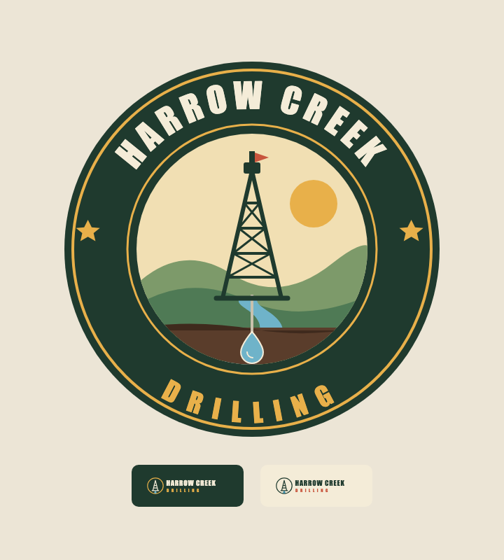
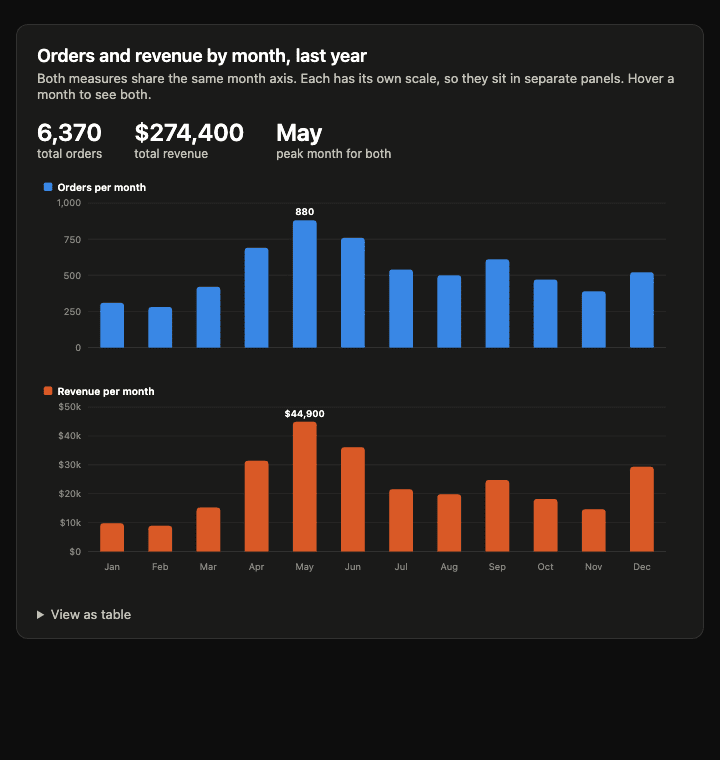
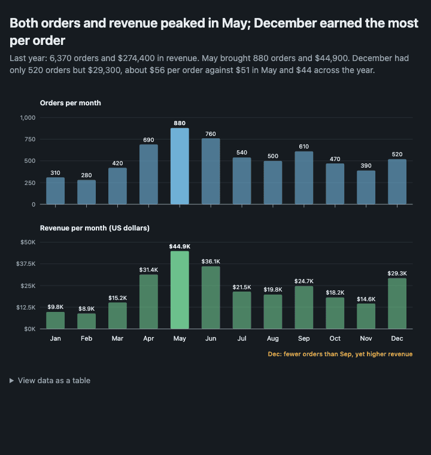
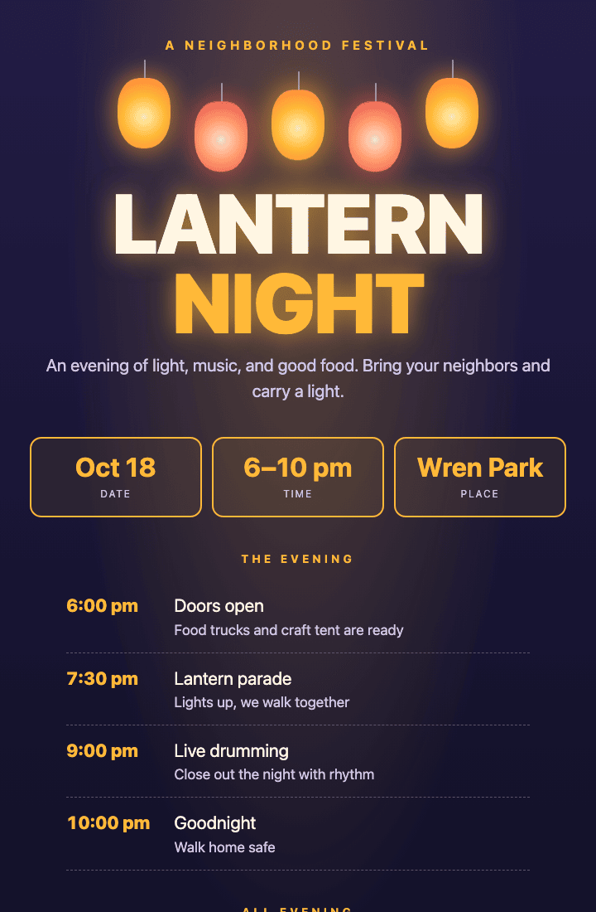
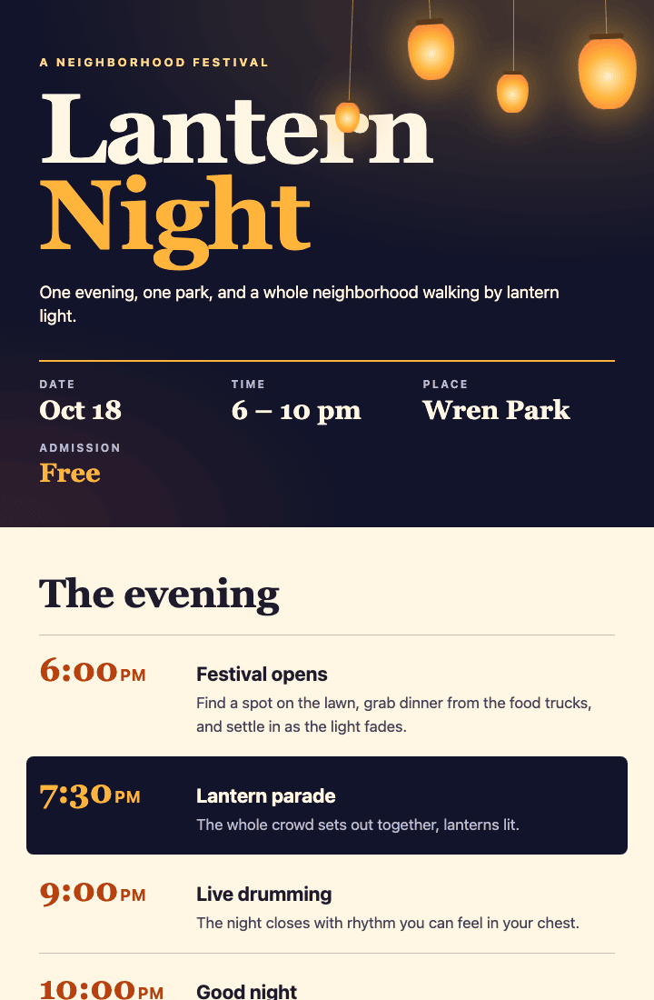
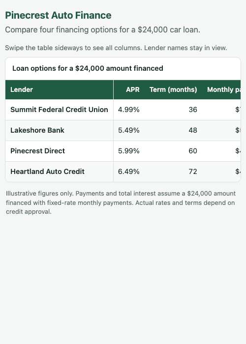
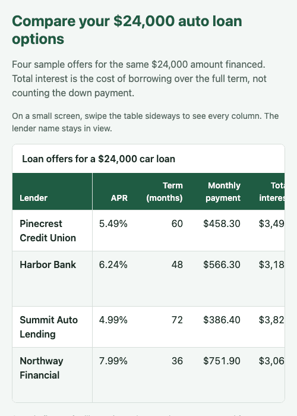
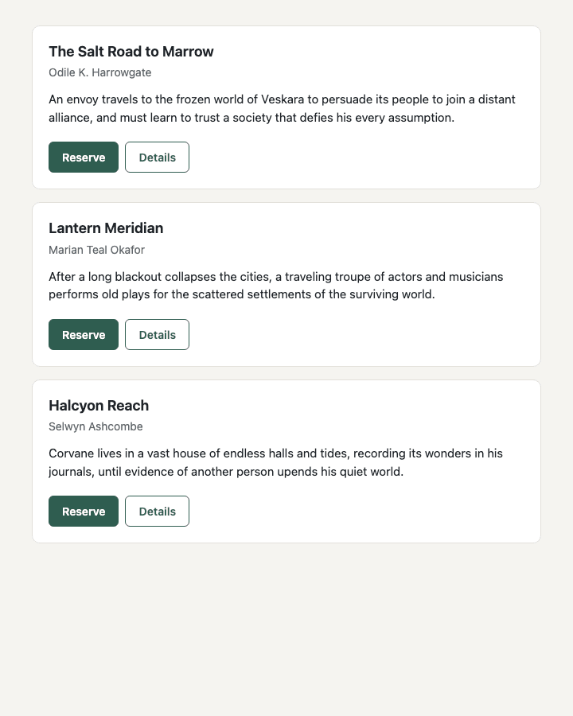
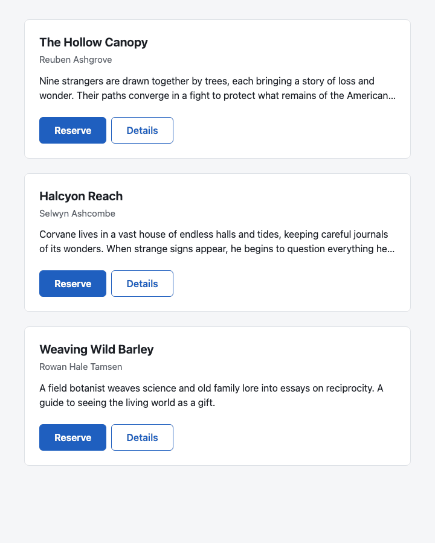

<p align="center"></p>

# design-and-copy-skills

26 skills (16 design, 10 copywriting) for AI coding agents, each tested against the same agent without the skill, with the losses and marginal results disclosed in [Results](#results). They are for people who use an agent to build or review interfaces, pages and writing.

Each skill is a short, focused instruction set that a coding agent loads when a task calls for it: ranking what a screen shows, setting text, building a chart, designing a form. It saves writing the same guidance into every prompt. Every skill ships with an eval: the same model answers the same tasks with and without the skill, and the answers are judged blind. A skill is kept only when, on tasks its writers never saw, it wins more often than it loses among the samples where it loaded, and its rubric score does not fall behind the baseline. A skill that only ties on wins can still be kept if its mean rubric edge is at least 0.15. Some passes are marginal and are marked. All wording is original; there are no excerpts.


## Skills

Sixteen design skills are listed below, and ten copywriting skills in [their own table](#copywriting-skills). The tables are generated from each skill's `SKILL.md` frontmatter. Each skill's held-out result, including which passes are marginal, is in [Results](#results).

<!-- results-table:skills:start -->
| Skill | Use when | Not for |
|---|---|---|
| [brand-identity](skills/brand-identity/SKILL.md) | a logo, mark, wordmark, app icon or visual identity is being made, judged or changed, in any language and at any length | interface palettes (color-palette), type choice (typeface-selection), design tokens (design-system-builder), product screens (design-critique) or naming and trademark law |
| [chart-design](skills/chart-design/SKILL.md) | you make, choose, fix or review a single chart, graph, sparkline or simple map (HTML, SVG, canvas or a chart library) | multi-chart dashboards or KPI screens, data tables, interface or brand palettes, diagrams that explain a mechanism, or statistical analysis |
| [color-palette](skills/color-palette/SKILL.md) | color is being chosen, judged or fixed, in any language and at any length | chart data scales (chart-design), logo design (brand-identity), token plumbing (design-system-builder) or type weight (typesetting) |
| [data-tables](skills/data-tables/SKILL.md) | you build, style or review a table of data in a page, app, document or report | charts, whole dashboards, page grids, short lists that are not tabular, or editing behavior inside spreadsheet engines |
| [design-critique](skills/design-critique/SKILL.md) | someone wants a design judged, in any words, any length or language | building or applying fixes (including the last small polish pass on a nearly finished screen), logo or identity critique (brand-identity) or code review |
| [design-system-builder](skills/design-system-builder/SKILL.md) | shared design decisions are being created, cleaned up or extended, in any language and at any length | styling one page (the focused skills), drawing a brand (brand-identity), or auditing a product without building (design-critique) |
| [form-design](skills/form-design/SKILL.md) | designing, building, reviewing or fixing a form or input flow | non-form widgets (tabs, menus, toasts), whole-app polish, editable data grids, or marketing copy around a form |
| [layout-structure](skills/layout-structure/SKILL.md) | you design, build, plan or review the overall structure of a page, screen, slide, poster or social graphic | CSS mechanics, spacing values, emphasis between elements, multi-chart dashboards, or single components such as a button sheet |
| [practice-and-assessment](skills/practice-and-assessment/SKILL.md) | people must practice, be checked on or retain a skill, in any language and at any length | onboarding screens (teaching-interfaces), quiz software or grading code, form fields (form-design) or reviewing a learning product's interface (design-critique) |
| [responsive-layout](skills/responsive-layout/SKILL.md) | CSS layout has to hold up on any screen, container or setting, including when someone says the page breaks on phones, overflows, scrolls sideways, clips, looks cramped when zoomed or stretched too wide, or asks to make it responsive, fluid, mobile-friendly or modern, in any language and at any length | choosing page structure (layout-structure), spacing values (spacing-and-grouping), dialog focus and other detailed component accessibility semantics or type scales (typesetting) |
| [spacing-and-grouping](skills/spacing-and-grouping/SKILL.md) | you design, build, restyle or review any interface or page where several items sit near each other | choosing emphasis, palettes, page grids, CSS layout mechanics, or expressive posters |
| [teaching-interfaces](skills/teaching-interfaces/SKILL.md) | a screen, page or flow has to teach someone to do or understand something, in any language and at any length | quizzes or courses (practice-and-assessment), input fields (form-design), animation timing (ui-motion), data charts (chart-design), marketing pages or general interface strings |
| [typeface-selection](skills/typeface-selection/SKILL.md) | a font is being chosen, paired, judged or fixed, in any language and at any length | sizes, leading or line length (typesetting), drawing logos (brand-identity), type tokens (design-system-builder) or palettes (color-palette) |
| [typesetting](skills/typesetting/SKILL.md) | text is being set, judged or fixed, in any language and at any length | choosing typefaces (typeface-selection), ranking a whole view (visual-hierarchy), palettes (color-palette) or logos (brand-identity) |
| [ui-motion](skills/ui-motion/SKILL.md) | someone wants an interface to feel smooth, responsive, alive, polished, premium or less janky, or asks to add, fix, cut, time, specify or review animation | video, film or character animation, detailed chart animation, print or static deliverables, or carousel semantics |
| [visual-hierarchy](skills/visual-hierarchy/SKILL.md) | a screen or page needs a clear order of importance, in any language and at any length | spacing values, type sizes, palettes and contrast numbers, page grids, chart encodings or logos |
<!-- results-table:skills:end -->

Three more skills were built and tested but did not meet the bar and are not shipped; see [Built and tested, not shipped](#built-and-tested-not-shipped).

## Copywriting skills

Copywriting skills live in their own folder, [copy-skills/](copy-skills/README.md), and follow the same rules as the design skills: original wording and an eval gate before a skill is listed. The table is generated from each skill's `SKILL.md` frontmatter.

<!-- results-table:copy:start -->
| Skill | Use when | Not for |
|---|---|---|
| [editing-and-cutting](copy-skills/editing-and-cutting/SKILL.md) | you edit, shorten, tighten or review text that already exists instead of writing new copy, in any language and at any length | checking whether claims are true (honest-claims), rebuilding a whole page (landing-page-copy), writing new headlines (headlines-and-leads) or code documentation |
| [email-and-sequences](copy-skills/email-and-sequences/SKILL.md) | you write, plan, fix or judge email or direct messages to customers, subscribers or prospects, in any language and at any length | receipts, resets and in-app notifications (ux-microcopy), the page an email links to (landing-page-copy) or checking claims (honest-claims) |
| [fair-persuasion](copy-skills/fair-persuasion/SKILL.md) | words or a screen flow are meant to move someone toward a choice, in any language and at any length | whether a claim is true (honest-claims), form field mechanics (form-design) or the screen strings themselves (ux-microcopy) |
| [headlines-and-leads](copy-skills/headlines-and-leads/SKILL.md) | you write, rewrite, shorten, pick or judge the first words someone reads, in any language and at any length | email subject lines (email-and-sequences), buttons and interface labels (ux-microcopy), whole pages (landing-page-copy) or a heading's size and weight (visual-hierarchy) |
| [honest-claims](copy-skills/honest-claims/SKILL.md) | copy states a fact, number, result, comparison, quote, rating, customer count, award, guarantee, price, deadline or stock limit, or someone asks to make it more persuasive, urgent, credible or "more official", to add social proof or reviews, to write quotes or statistics they have not supplied, or to check a page for claims that could get them in trouble, in any language | defaults, cancellation flows or other choice design (fair-persuasion), or general line editing (editing-and-cutting) |
| [landing-page-copy](copy-skills/landing-page-copy/SKILL.md) | you write, rewrite or plan the words of a page meant to win someone over, such as home, landing, sales, product, feature, pricing, about or case-study pages, including "write my homepage", "this page doesn't convert", "make it less salesy", "nobody gets what we do", "turn these notes into a landing page" or "redo our website copy", in any language and at any length | how the page looks (layout-structure, visual-hierarchy), a single headline (headlines-and-leads), in-product strings, emails, or reviewing a whole site (website-copy-audit) |
| [offers-and-value-propositions](copy-skills/offers-and-value-propositions/SKILL.md) | you word what is offered and why it is worth the price, in any language and at any length | audience or category (positioning-and-messaging), table layout (data-tables), checkout fields (form-design) or legal terms |
| [positioning-and-messaging](copy-skills/positioning-and-messaging/SKILL.md) | someone needs to decide or put into words what a product or company is, who it is for and why it beats what they use now, in any language and at any length | full pages (landing-page-copy), sets of headlines (headlines-and-leads), offer terms and pricing (offers-and-value-propositions), or logos and visual identity |
| [ux-microcopy](copy-skills/ux-microcopy/SKILL.md) | you write or fix the words inside a product or a transactional message, in any language and at any length | form fields and validation (form-design), marketing pages or email sequences, or ARIA and focus |
| [website-copy-audit](copy-skills/website-copy-audit/SKILL.md) | someone wants existing site or product copy judged rather than written, in any language and at any length | writing new pages (landing-page-copy), line editing alone, or reviewing visual design |
<!-- results-table:copy:end -->

## Archived evidence

`withdrawn/` holds earlier held-out runs, kept with their tasks and answers as evidence. The folders are not skills and are not meant to be installed. A folder here is not a failure by itself: the gate column says whether that earlier run passed, and where a skill has a newer held-out run, the [results table](#results) shows the newer one.

<!-- results-table:withdrawn:start -->
| Skill | Protocol | Samples per arm | Wins / losses / ties, all samples | Wins / losses / ties, loaded only | Mean rubric, with / without (loaded only under protocol 2) | Skill loaded by the model | Gate | Judge | Secondary row (weaker generator, not gated) |
|---|---|---|---|---|---|---|---|---|---|
| chart-design-v1-evidence | 1 | 1 | 7 / 2 / 1 | 5 / 2 / 1 (8 tasks) | 4.71 / 4.46 | 8 of 10 samples (8 of 10 tasks) | pass | `claude:opus`, a different model from the generator | none |
| color-palette-v1-evidence | 1 | 1 | 6 / 2 / 2 | 5 / 2 / 0 (7 tasks) | 4.79 / 4.508 | 7 of 10 samples (7 of 10 tasks) | pass | `claude:opus`, a different model from the generator | none |
| design-critique-v1-evidence | 1 | 1 | 4 / 2 / 4 | 2 / 1 / 1 (4 tasks) | 4.39 / 4.28 | 4 of 10 samples (4 of 10 tasks) | pass | `claude:opus`, a different model from the generator | none |
| honest-claims-v1-evidence | 1 | 1 | 5 / 4 / 1 | 5 / 3 / 1 (9 tasks) | 4.54 / 4.57 | 9 of 10 samples (9 of 10 tasks) | pass | `claude:opus`, a different model from the generator | none |
| typesetting-v1-evidence | 1 | 1 | 3 / 4 / 3 | 2 / 4 / 3 (9 tasks) | 4.459 / 4.735 | 9 of 10 samples (9 of 10 tasks) | fail | `claude:opus`, a different model from the generator | none |
| visual-hierarchy-v1-evidence | 1 | 1 | 5 / 1 / 4 | 5 / 1 / 3 (9 tasks) | 4.742 / 4.445 | 9 of 10 samples (9 of 10 tasks) | pass | `claude:opus`, a different model from the generator | none |
<!-- results-table:withdrawn:end -->

## Withdrawn

The first `typesetting` attempt was withdrawn after failing its held-out gate three times: with the skill loaded the model over-corrected text that was already fine and did not beat the same model without it. The three runs (generator `claude-sonnet-5-5`, judge `claude:opus`) went 1 / 4 / 5, 2 / 4 / 4 and 3 / 4 / 3 for wins, losses and ties. The archived table above shows the last run, kept with its tasks and answers under `withdrawn/typesetting-v1-evidence/`.

The `typesetting` skill was then rewritten. The first rewrite went 4 / 5 / 1 (mean rubric 4.438 / 4.393) on a fresh held-out set and failed the gate; after one revision it went 4 / 4 / 2 (4.598 / 4.368) under the same one-answer protocol. The text now in `skills/` is a later rewrite, run on a newer task set under protocol 2: 6 / 2 / 2 over all samples and 6 / 2 / 1 on the 9 tasks where the skill loaded (mean rubric 4.625 / 4.305). That is the `typesetting` row in the [results table](#results).

### Built and tested, not shipped

Three skills were built and run against held-out tasks, did not meet the bar, and are not in `skills/` or installable:

| Skill | Held-out result, wins / losses / ties where the skill loaded |
|---|---|
| accessible-components | 2 / 5 / 3 |
| dashboard-design | 1 / 2 / 6 |
| ui-polish-pass | inconclusive: the model rarely loaded the skill, so too few tasks had a loaded sample to judge |

Only their held-out task files are kept, under `withdrawn/<name>-pulled-evidence/heldout/`.

## Install

A skill is a folder with a `SKILL.md` and a `references/` directory. Installing means copying that folder to wherever your agent looks for skills. The copy is self-contained; the clone is only needed to copy from. Design skills live in `skills/` and copywriting skills in `copy-skills/`; both install to the same place.

**Claude Code.** Project skills live in `.claude/skills/` inside the repository you are working on and are shared with everyone who clones it. Personal skills live in `~/.claude/skills/` and apply to every project on your machine.

```sh
git clone --depth 1 https://github.com/thewyattbrocato/design-and-copy-skills.git

# one skill, for the current project
mkdir -p .claude/skills && cp -R design-and-copy-skills/skills/visual-hierarchy .claude/skills/

# one skill, for every project on this machine
mkdir -p ~/.claude/skills && cp -R design-and-copy-skills/skills/form-design ~/.claude/skills/

# one copywriting skill, same destination
cp -R design-and-copy-skills/copy-skills/ux-microcopy .claude/skills/

# every design skill at once
cp -R design-and-copy-skills/skills/* .claude/skills/

# every copywriting skill at once (copy-skills/ also holds a README, so copy folders only)
for d in design-and-copy-skills/copy-skills/*; do [ -d "$d" ] && cp -R "$d" .claude/skills/; done
```

Choose what you need rather than installing everything. Several skills (typesetting, visual-hierarchy, spacing-and-grouping, color-palette, responsive-layout) describe themselves as applying to any page or build, so with all of them installed a single build can load several at once.

**Other tools.** The skills use the [Agent Skills](https://agentskills.io/) format: a `SKILL.md` with `name` and `description` frontmatter plus a `references/` folder. Many compatible tools scan `.agents/skills/` in the project and `~/.agents/skills/` for the user, and some also read the `.claude/skills/` locations above. Use the same copy commands with the directory your tool documents.

Once installed, the agent loads a skill when a request matches its description. In Claude Code you can also invoke one by name, for example `/form-design`. The description of each skill ends with what it is not for, so neighboring skills do not fight over a task.

## How the evals work


The promise is that a skill never makes the model worse. Every skill has a held-out task suite, and six older ones (chart-design, data-tables, form-design, layout-structure, spacing-and-grouping, visual-hierarchy) also have a development suite. Each suite has 8 to 10 realistic tasks and a rubric of observable criteria:

- the **held-out set**, `evals/<skill>/heldout/tasks.json`, written by someone who never reads the skill, and the only set that counts as clean evidence;
- the **development set**, `evals/<skill>/tasks.json`, which the skill writers saw while they wrote and refined the skill. Not clean evidence.

`scripts/run_eval.py --suite dev|heldout` (held-out is the default when it exists) then:

- has the same model answer every task three times per arm (`--samples`) with the identical prompt, with the skill installed and without;
- renders build tasks to screenshots and sends each pair of samples to a judge model, blind, with the sides labeled A and B by a seeded coin flip, and asks for a verdict and a 1 to 5 score per rubric item;
- refuses to run when the judge is the same model as the generator, unless `--allow-same-model-judge` is passed; the run then records `same_model_judge` and a held-out results file with that flag does not validate;
- judges every pair a second time with the sides swapped. A win counts only when both passes pick the same side; any disagreement is recorded as a tie, and a task's verdict is the majority over its samples;
- records whether the model loaded the skill in each with-skill sample, regenerates a sample that did not load (up to twice), and reports two tallies: all samples and loaded-only;
- applies the protocol 2 gate to the loaded-only tally: at least 6 tasks must have a loaded sample (otherwise the result is `inconclusive`, which is not a pass), the with-skill side must win more often than it loses (or tie on wins with a mean rubric advantage of at least 0.15), and its mean rubric score must not fall more than 0.1 below the baseline. A tie is not a pass for a skill that should clearly help;
- can run the same suite with a weaker generator (`--secondary-model`), shown as its own column and never part of the gate.

Results written before protocol 2 are marked `protocol: 1`: one answer per arm per task and a gate that a tie passed. They are kept as they are and shown in the same tables.

`scripts/check_skill_fixtures.py` keeps the two apart: it fails when a name, number or quoted string from a held-out task prompt or rubric appears anywhere in a skill folder (`skills/`, `copy-skills/`, or a skill folder under `withdrawn/`), so a skill cannot be shown the answer to the task that tests it. Hits from the development tasks are warnings.

The method, commands and the headless CLI setup are in [evals/README.md](evals/README.md); the file formats are in [evals/SCHEMA.md](evals/SCHEMA.md). `results.json` records both judge passes, the per-item scores, the judge's notes, the judge and the gate numbers, so a verdict can be re-read and the gate recomputed with `scripts/validate_evals.py`.

### Results


This chart is generated from the stored held-out results files by `scripts/make_results_chart.py`, and it counts only the runs where the model loaded the skill.

The tables below are generated from the results files by `scripts/results_table.py`, and CI fails when this file does not match them. Every run has answers from `claude-sonnet-5-5`, the skill installed as a project skill, seed 0 and 10 tasks. The "Skill loaded by the model" column gives the samples in which the model loaded the skill and, in brackets, the tasks with at least one such sample. Under protocol 1 the all-samples column counts every pair, including tasks where the model never loaded the skill; the loaded-only column is recomputed from whether it loaded on each task, and is the one to read.

**Held-out set.** Clean evidence: the skill writers never saw these tasks. A skill with no held-out results yet shows `pending clean rerun`.

<!-- results-table:heldout:start -->
| Skill | Protocol | Samples per arm | Wins / losses / ties, all samples | Wins / losses / ties, loaded only | Mean rubric, with / without (loaded only under protocol 2) | Skill loaded by the model | Gate | Judge | Secondary row (weaker generator, not gated) |
|---|---|---|---|---|---|---|---|---|---|
| brand-identity | 2 | 3 | 5 / 2 / 3 | 5 / 2 / 3 (10 tasks) | 4.409 / 4.007 | 29 of 30 samples (10 of 10 tasks) | pass | `claude:opus`, a different model from the generator | `haiku`: 4 / 2 / 2 loaded only |
| chart-design | 2 | 3 | 5 / 1 / 4 | 5 / 1 / 3 (9 tasks) | 4.646 / 4.517 | 26 of 30 samples (9 of 10 tasks) | pass, marginal (rubric +0.13) | `claude:opus`, a different model from the generator | `haiku`: 2 / 2 / 0 loaded only |
| color-palette | 2 | 3 | 6 / 3 / 1 | 5 / 2 / 2 (9 tasks) | 4.537 / 4.344 | 23 of 30 samples (9 of 10 tasks) | pass | `claude:opus`, a different model from the generator | `haiku`: 2 / 1 / 0 loaded only |
| data-tables | 1 | 1 | 6 / 3 / 1 | 5 / 3 / 1 (9 tasks) | 4.685 / 4.183 | 9 of 10 samples (9 of 10 tasks) | pass | `claude:opus`, a different model from the generator | none |
| design-critique | 2 | 3 | 5 / 3 / 2 | 4 / 1 / 1 (6 tasks) | 4.334 / 3.833 | 17 of 30 samples (6 of 10 tasks) | pass, marginal (6 loaded tasks) | `claude:opus`, a different model from the generator | `haiku`: 3 / 0 / 0 loaded only |
| design-system-builder | 2 | 3 | 4 / 2 / 4 | 3 / 2 / 4 (9 tasks) | 4.223 / 4.094 | 27 of 30 samples (9 of 10 tasks) | pass, marginal (rubric +0.13; one-task win margin) | `claude:opus`, a different model from the generator | `haiku`: 0 / 1 / 1 loaded only |
| form-design | 1 | 1 | 6 / 0 / 4 | 6 / 0 / 4 (10 tasks) | 4.713 / 4.375 | 10 of 10 samples (10 of 10 tasks) | pass | `claude:opus`, a different model from the generator | none |
| layout-structure | 1 | 1 | 5 / 2 / 3 | 3 / 2 / 2 (7 tasks) | 4.385 / 4.085 | 7 of 10 samples (7 of 10 tasks) | pass, marginal (one-task win margin) | `claude:opus`, a different model from the generator | none |
| practice-and-assessment | 2 | 3 | 6 / 3 / 1 | 6 / 2 / 0 (8 tasks) | 4.521 / 3.912 | 24 of 30 samples (8 of 10 tasks) | pass | `claude:opus`, a different model from the generator | `haiku`: 1 / 0 / 1 loaded only |
| responsive-layout | 1 | 1 | 7 / 2 / 1 | 3 / 2 / 1 (6 tasks) | 4.417 / 4.02 | 6 of 10 samples (6 of 10 tasks) | pass, marginal (6 loaded tasks; one-task win margin) | `claude:opus`, a different model from the generator | none |
| spacing-and-grouping | 1 | 1 | 5 / 3 / 2 | 5 / 3 / 1 (9 tasks) | 4.35 / 4.095 | 9 of 10 samples (9 of 10 tasks) | pass | `claude:opus`, a different model from the generator | none |
| teaching-interfaces | 2 | 3 | 5 / 2 / 3 | 5 / 2 / 2 (9 tasks) | 4.466 / 4.28 | 26 of 30 samples (9 of 10 tasks) | pass | `claude:opus`, a different model from the generator | `haiku`: 3 / 2 / 0 loaded only |
| typeface-selection | 2 | 3 | 6 / 2 / 2 | 4 / 2 / 1 (7 tasks) | 4.524 / 4.381 | 21 of 30 samples (7 of 10 tasks) | pass, marginal (rubric +0.14) | `claude:opus`, a different model from the generator | `haiku`: 3 / 1 / 2 loaded only |
| typesetting | 2 | 3 | 6 / 2 / 2 | 6 / 2 / 1 (9 tasks) | 4.625 / 4.305 | 23 of 30 samples (9 of 10 tasks) | pass | `claude:opus`, a different model from the generator | `haiku`: 3 / 1 / 2 loaded only |
| ui-motion | 1 | 1 | 4 / 3 / 3 | 4 / 1 / 3 (8 tasks) | 4.481 / 4.485 | 8 of 10 samples (8 of 10 tasks) | pass, marginal (rubric level) | `claude:opus`, a different model from the generator | none |
| visual-hierarchy | 2 | 3 | 7 / 1 / 2 | 8 / 0 / 2 (10 tasks) | 4.503 / 4.125 | 28 of 30 samples (10 of 10 tasks) | pass | `claude:opus`, a different model from the generator | `haiku`: 4 / 1 / 0 loaded only |
| editing-and-cutting | 2 | 3 | 4 / 1 / 5 | 5 / 0 / 4 (9 tasks) | 4.548 / 4.12 | 23 of 30 samples (9 of 10 tasks) | pass | `claude:opus`, a different model from the generator | `haiku`: 3 / 1 / 2 loaded only |
| email-and-sequences | 2 | 3 | 6 / 2 / 2 | 6 / 1 / 2 (9 tasks) | 4.691 / 4.209 | 23 of 30 samples (9 of 10 tasks) | pass | `claude:opus`, a different model from the generator | `haiku`: 2 / 0 / 4 loaded only |
| fair-persuasion | 2 | 3 | 7 / 1 / 2 | 6 / 1 / 2 (9 tasks) | 4.726 / 3.941 | 27 of 30 samples (9 of 10 tasks) | pass | `claude:opus`, a different model from the generator | `haiku`: 5 / 1 / 0 loaded only |
| headlines-and-leads | 2 | 3 | 7 / 2 / 1 | 7 / 1 / 1 (9 tasks) | 4.459 / 3.952 | 25 of 30 samples (9 of 10 tasks) | pass | `claude:opus`, a different model from the generator | `haiku`: 5 / 2 / 1 loaded only |
| honest-claims | 2 | 3 | 5 / 1 / 4 | 5 / 1 / 4 (10 tasks) | 4.58 / 4.37 | 26 of 30 samples (10 of 10 tasks) | pass | `claude:opus`, a different model from the generator | `haiku`: 7 / 1 / 1 loaded only |
| landing-page-copy | 2 | 3 | 5 / 2 / 3 | 5 / 2 / 2 (9 tasks) | 4.669 / 4.315 | 27 of 30 samples (9 of 10 tasks) | pass | `claude:opus`, a different model from the generator | `haiku`: 4 / 5 / 0 loaded only |
| offers-and-value-propositions | 2 | 3 | 6 / 3 / 1 | 4 / 3 / 1 (8 tasks) | 4.319 / 4.185 | 23 of 30 samples (8 of 10 tasks) | pass, marginal (rubric +0.13; one-task win margin) | `claude:opus`, a different model from the generator | `haiku`: 6 / 1 / 0 loaded only |
| positioning-and-messaging | 2 | 3 | 6 / 1 / 3 | 4 / 0 / 3 (7 tasks) | 4.63 / 4.366 | 21 of 30 samples (7 of 10 tasks) | pass | `claude:opus`, a different model from the generator | `haiku`: 7 / 1 / 0 loaded only |
| ux-microcopy | 2 | 3 | 6 / 1 / 3 | 6 / 1 / 2 (9 tasks) | 4.509 / 4.179 | 27 of 30 samples (9 of 10 tasks) | pass | `claude:opus`, a different model from the generator | `haiku`: 7 / 3 / 0 loaded only |
| website-copy-audit | 2 | 3 | 7 / 3 / 0 | 4 / 2 / 0 (6 tasks) | 4.474 / 4.066 | 18 of 30 samples (6 of 10 tasks) | pass, marginal (6 loaded tasks) | `claude:opus`, a different model from the generator | `haiku`: 4 / 0 / 0 loaded only |
<!-- results-table:heldout:end -->

**Marginal passes.** The script marks a passing row `marginal`, with the reasons, when any of these holds: the loaded-only mean rubric advantage is below +0.15; fewer than 7 tasks had a loaded sample; or the loaded-only win margin (wins minus losses) is at most one task. A marginal pass is weaker evidence than a plain `pass`, not a failure. Under protocol 1 the rubric means cover every pair, because those files do not record loaded-only means. The `ui-motion` rubric is level (4.481 with the skill, 4.485 without): it shows no measured rubric gain.

**Development set, seen by the skill writers; not clean evidence.** These runs were made on 2026-10-04 on the tasks the skill writers worked from, and some skill reference files contained worked answers that mirror those tasks, so a win here can be recall of a supplied answer. The judge differs by row and the rows are not comparable with each other:

- The first four skills (chart-design, data-tables, layout-structure, spacing-and-grouping) were judged by `grok:grok-4.7`, a different model from the generator.
- The three refined skills (visual-hierarchy, typesetting, form-design) were re-run after the Grok judge reached a usage limit and were judged by Claude Sonnet (`claude:sonnet`). That is the same model as the generator, `claude-sonnet-5-5`, so the generator scored its own answers in both arms. Self-preference should affect both arms alike, but it is not a separate judge, and those rows cannot be read against the Grok rows.
- The held-out runs use a judge that is a different model from the generator (`claude:opus` by default) and record it in `results.json`.

<!-- results-table:dev:start -->
| Skill | Protocol | Samples per arm | Wins / losses / ties, all samples | Wins / losses / ties, loaded only | Mean rubric, with / without (loaded only under protocol 2) | Skill loaded by the model | Gate | Judge | Secondary row (weaker generator, not gated) | Notes |
|---|---|---|---|---|---|---|---|---|---|---|
| brand-identity | no development results | | | | | | | | | |
| chart-design | 1 | 1 | 3 / 3 / 4 | 1 / 2 / 1 (4 tasks) | 4.768 / 4.745 | 4 of 10 samples (4 of 10 tasks) | pass | `grok:grok-4.7`, a different model from the generator | none | superseded by the held-out run; 10 answer files not committed |
| color-palette | no development results | | | | | | | | | |
| data-tables | 1 | 1 | 4 / 1 / 5 | 2 / 0 / 3 (5 tasks) | 4.525 / 4.105 | 5 of 10 samples (5 of 10 tasks) | pass | `grok:grok-4.7`, a different model from the generator | none | superseded by the held-out run |
| design-critique | no development results | | | | | | | | | |
| design-system-builder | no development results | | | | | | | | | |
| form-design | 1 | 1 | 6 / 1 / 3 | 6 / 1 / 2 (9 tasks) | 4.638 / 4.248 | 9 of 10 samples (9 of 10 tasks) | pass | `claude:sonnet`, same model as the generator | none | superseded by the held-out run |
| layout-structure | 1 | 1 | 5 / 1 / 4 | 3 / 0 / 1 (4 tasks) | 4.708 / 4.385 | 4 of 10 samples (4 of 10 tasks) | pass | `grok:grok-4.7`, a different model from the generator | none | superseded by the held-out run |
| practice-and-assessment | no development results | | | | | | | | | |
| responsive-layout | no development results | | | | | | | | | |
| spacing-and-grouping | 1 | 1 | 5 / 0 / 5 | 4 / 0 / 1 (5 tasks) | 4.433 / 4.045 | 5 of 10 samples (5 of 10 tasks) | pass | `grok:grok-4.7`, a different model from the generator | none | superseded by the held-out run |
| teaching-interfaces | no development results | | | | | | | | | |
| typeface-selection | no development results | | | | | | | | | |
| typesetting | no development results | | | | | | | | | |
| ui-motion | no development results | | | | | | | | | |
| visual-hierarchy | 1 | 1 | 7 / 2 / 1 | 6 / 1 / 1 (8 tasks) | 4.537 / 4.155 | 8 of 10 samples (8 of 10 tasks) | pass | `claude:sonnet`, same model as the generator | none | superseded by the held-out run |
| editing-and-cutting | no development results | | | | | | | | | |
| email-and-sequences | no development results | | | | | | | | | |
| fair-persuasion | no development results | | | | | | | | | |
| headlines-and-leads | no development results | | | | | | | | | |
| honest-claims | no development results | | | | | | | | | |
| landing-page-copy | no development results | | | | | | | | | |
| offers-and-value-propositions | no development results | | | | | | | | | |
| positioning-and-messaging | no development results | | | | | | | | | |
| ux-microcopy | no development results | | | | | | | | | |
| website-copy-audit | no development results | | | | | | | | | |
<!-- results-table:dev:end -->

What these numbers can and cannot say:

- Noise floor: ten tasks cannot detect a small effect. If a skill has no effect, each decisive task goes either way like a coin flip, so with 9 decisive tasks it wins 2 to 7 of them in 95% of runs; a few more wins than losses is inside that range and is not evidence. Every run prints the range for its own count. A pass means no evidence of harm on these tasks, not proof of benefit everywhere.
- The model decides whether to load an installed skill. The "skill loaded" column shows how often it did; under protocol 1 the with-skill answer on the other tasks was produced without the skill, so the comparison there is model noise, and the protocol 1 gate counted those pairs anyway. Protocol 2 gates on loaded samples only.
- A held-out set that was revised after its results were seen is no longer held out. A revision made after seeing held-out results requires a fresh held-out set. Each protocol 2 results file records a hash of its `tasks.json`, and the validator warns when the tasks no longer match it.
- The chart-design baseline was not a bare model. The CLI's bundled `dataviz` skill fired in the baseline arm in 5 of 10 tasks, so the comparison there is against the model using a chart skill, and a tie means the skill added little beyond it. The older revisions of chart-design did not beat that baseline; the live text, unchanged since, later passed a fresh held-out set, marginally. See [evals/README.md](evals/README.md).
- One baseline was regenerated: during the typesetting refinement the runner regenerated the `ts-guard-wordmark` baseline answer, so for that task the baseline is not the original. The other baseline answers were reused.
- Twelve answer files behind development-set verdicts (both arms of five chart-design tasks, one arm of each of two typesetting tasks) were never committed, so those verdicts cannot be re-read. The validator now requires every run folder to hold both answers; the development results are marked superseded for that reason.
- Judges have taste and can favor longer or more polished-looking answers; a second judge on a close result would be stronger evidence.
- Rubrics were written alongside the skill and some criteria echo its rules, so the eval partly measures adoption of the skill's rules. The guard tasks, where a rule applied blindly would be wrong, are the check on that.
- Protocol 1 results have one answer per task per arm, so rerunning with fresh answers can move a close result; protocol 2 takes three samples and a majority, which reduces that without removing it. The seed fixes the blind order, not the model.
- Build tasks are judged from a fixed 1280 by 800 screenshot, so content below the fold and interaction are not judged.

## Showcase

[docs/examples](docs/examples/README.md) shows four realistic requests, each given to the same model with and without one skill installed and rendered from the HTML the model wrote: eight before-and-after pairs in all, with the numbers, the judge and the median-run rule written out. It is an illustration, not a measurement; three runs per arm and one judge cannot separate small differences. `scripts/make_example.py` makes the renders.

For one short before-and-after from the stored test runs of every skill, see [Before and after, for every skill](#before-and-after-for-every-skill).

## Before and after, for every skill

<!-- before-after:start -->
Each panel below opens to one task from a skill's held-out run: the answer without the skill beside the answer with it, shortened but never rewritten (a cut is marked `[...]`). Each task shown was chosen as the task with the largest judged difference in favor of the skill among tasks where the skill loaded and the answers can be shown without altering them, so these are favorable examples by construction. The tally in each heading is the skill's wins / losses / ties over the tasks where it loaded, and `marginal` marks a pass the [Results](#results) section calls marginal. The full run files are in `evals/<skill>/heldout/runs/`. For the unselected, real-request examples see [Showcase](#showcase).

### Design skills

<details>
<summary><b>brand-identity</b> &middot; 5 / 2 / 3 loaded only</summary>

> I run a well drilling company out in the country, Harrow Creek Drilling. Never had a real logo, just the name painted on the trucks. Can you make one? Give me a single self-contained HTML file with inline CSS and inline SVG, system fonts only, no external assets, showing the logo so I can see what it looks like.

| Without the skill | With the skill |
|---|---|
| A single HTML page showing one round badge logo for Harrow Creek Drilling: the name set around a dark green ring, with a drilling derrick, sun, hills, creek and water drop inside, and two small logo versions below. | A single HTML page showing a logo built from a dark disc with a borehole cut down through it to a blue pocket of water, next to a stacked "HARROW CREEK" wordmark with "DRILLING" under a rule, followed by a grid of solid black, reversed, stacked and small versions. |
|  |  |

[Full run files](evals/brand-identity/heldout/runs/brand-h01/)

Judged difference on this task: +1.30 rubric points. Overall for this skill: 5 wins / 2 losses / 3 ties (loaded-only) over 10 tasks.

</details>

<details>
<summary><b>chart-design</b> &middot; 5 / 1 / 3 loaded only &middot; marginal</summary>

> I run a plant nursery and I'd like one chart that shows orders and revenue by month for last year so my business partner can see them together. Orders: Jan 310, Feb 280, Mar 420, Apr 690, May 880, Jun 760, Jul 540, Aug 500, Sep 610, Oct 470, Nov 390, Dec 520. Revenue in dollars: Jan 9800, Feb 8900, Mar 15200, Apr 31400, May 44900, Jun 36100, Jul 21500, Aug 19800, Sep 24700, Oct 18200, Nov 14600, Dec 29300. Please give me one self-contained HTML file, inline CSS, system fonts, no external assets.

| Without the skill | With the skill |
|---|---|
| An HTML page with two stacked bar charts of a plant nursery's monthly orders and revenue for last year, on a dark background. | An HTML page with two stacked bar charts of a plant nursery's monthly orders and revenue for last year, with a headline about the May peak, direct value labels and a note on December. |
|  |  |

[Full run files](evals/chart-design/heldout/runs/cd2-h03/)

Judged difference on this task: +0.44 rubric points. Overall for this skill: 5 wins / 1 losses / 3 ties (loaded-only) over 9 tasks.

</details>

<details>
<summary><b>color-palette</b> &middot; 5 / 2 / 2 loaded only</summary>

> Fernhollow Credit Union is a member-owned credit union in a mid-size town. Its homepage has: a hero with a Join today button, a strip of current loan and savings rates, three calculator tiles, a row of member testimonials, and a dark footer with branch hours. I'm torn between a deep forest green, a navy, and a plum for the main color. Pick one and tell me where color should and shouldn't show up across those sections.

| Without the skill | With the skill |
|---|---|
| \*\*Pick: deep forest green.\*\* It fits the name (Fernhollow), and it reads as steady and local. Navy is the default for banks, so a green credit union stands out from them. Plum is distinctive but feels more lifestyle than money, and it gets tricky when you need status colors. Choose a green dark enough to pass contrast with white text. Something near \`\#1F4D3A\` works. Add one warm accent, such as a muted gold or amber, for small highlights.<br><br>\*\*Where color should show up\*\*<br><br>- \*\*Hero:\*\* This is the strongest use of color. Use a green field, or a photo with a green overlay, with white headline text. Make the \*\*Join today\*\* button the one high-contrast element. Fill it with the warm accent and dark text, so it's the only thing on the page that looks like that. A green button on a green hero would blend in.<br>\[...\]<br>\*\*Rule of thumb:\*\* About 70% of the page should be white or neutral, about 20% green, and about 10% accent. If you can only remember one thing, use the green in the hero and footer, keep the middle neutral, and save the accent for the button. | \*\*Pick: deep forest green, \`\#1F4D3A\`.\*\*<br><br>- \*\*Why green:\*\* "Fern" and "hollow" already put green in the name. Navy is what nearly every bank uses, so it would make Fernhollow look like all of them. Green still reads as money and trust, and it suits a local, member-owned place.<br>\[...\]<br>\#\# Palette<br><br>&#124; Role &#124; Value &#124; Use &#124; Contrast (estimated) &#124;<br>&#124;---&#124;---&#124;---&#124;---&#124;<br>&#124; Lead &#124; \`\#1F4D3A\` &#124; Hero ground, icons, link and hover accents &#124; White on it: about 9.6:1 &#124;<br>&#124; Accent (once) &#124; \`\#F2C14E\` &#124; "Join today" button only, with \`\#14211B\` text &#124; About 9.9:1 &#124;<br>&#124; Ink &#124; \`\#17261F\` &#124; Headlines, rate numbers, body text &#124; High on all light grounds &#124;<br>&#124; Secondary text &#124; \`\#4A5D52\` &#124; Rate labels, captions &#124; About 6.1:1 on \`\#EAF0EA\` &#124;<br>&#124; Page and cards &#124; \`\#FFFFFF\` / \`\#F4F7F3\` &#124; Green-tinted off-white, not gray &#124; n/a &#124;<br>&#124; Rates band &#124; \`\#EAF0EA\` &#124; Strip background &#124; n/a &#124;<br>&#124; Hairlines &#124; \`\#D5DED7\` &#124; Card borders, dividers &#124; n/a &#124;<br>&#124; Footer &#124; \`\#14211B\` &#124; Green-tinted near-black &#124; n/a &#124;<br>&#124; Footer text &#124; \`\#E8EEE9\`, \`\#A9BDB1\` &#124; Primary and secondary text &#124; About 14:1 and 8.4:1 &#124;<br>\[...\]<br>I couldn't run a contrast checker, so the ratios are hand-calculated estimates. Please verify them before you ship. |

[Full run files](evals/color-palette/heldout/runs/cp2-03-credit-union-layout/)

Judged difference on this task: +0.89 rubric points. Overall for this skill: 5 wins / 2 losses / 2 ties (loaded-only) over 9 tasks.

</details>

<details>
<summary><b>data-tables</b> &middot; 5 / 3 / 1 loaded only</summary>

> We have a simple three-column table in our docs: Setting, Default, Meaning. Eight rows, left aligned text, a thin bottom border on each row, header row bold with a light gray background, 14px text with 8px 12px cell padding. Any problems?

| Without the skill | With the skill |
|---|---|
| Your spec is mostly fine, but a few things are worth checking:<br><br>\*\*Likely problems\*\*<br><br>1. \*\*Header semantics.\*\* If the header is just bold text in a styled row rather than \`&lt;th&gt;\` elements (ideally in \`&lt;thead&gt;\` with \`scope="col"\`), screen readers won't treat it as a header. Check the markup.<br>\[...\]<br>3. \*\*Default values need monospace.\*\* Values like \`true\`, \`30s\`, \`""\` or \`null\` are easy to misread in proportional text. Empty strings and whitespace are especially ambiguous. Consider \`&lt;code&gt;\` styling for both Setting and Default.<br><br>\*\*Worth checking\*\*<br><br>4. \*\*Border collapse.\*\* A "thin bottom border on each row" only renders properly on \`&lt;tr&gt;\` if you use \`border-collapse: collapse\`. Otherwise the border may not show, or it may show with gaps between cells. Put the border on \`td\`/\`th\` if in doubt.<br>5. \*\*Last row border.\*\* The last row's border can double up with the table's own bottom edge or container border. Remove it if so.<br>\[...\]<br>8. \*\*Setting column wrapping.\*\* Long setting names like \`max\_connection\_pool\_size\` can wrap awkwardly. Use \`white-space: nowrap\` on that column, or \`overflow-wrap: anywhere\` if you expect very long names.<br><br>\*\*Not a problem\*\*<br><br>- Left alignment, 14px text, and the padding are all reasonable. Left alignment is correct for text columns. If a Default column is purely numeric, you could right-align it, but mixed values mean left is better. | No real problems. The spec matches what works for a settings reference, and I only have a few things to check.<br><br>\*\*What's fine\*\*<br>- \*\*Left alignment:\*\* The Default column holds mixed values like \`true\`, \`30s\` and \`"auto"\`, so it should be treated as text and left-aligned.<br>- \*\*Row separation:\*\* A hairline under each row is one device, which is enough. Don't add zebra stripes or vertical rules on top of it.<br>- \*\*Header:\*\* Bold text on a light gray background reads clearly. Eight rows don't need sorting or a sticky header.<br>- \*\*Text size:\*\* 14px is the minimum I'd use.<br><br>\*\*What to check\*\*<br>1. \*\*Row height:\*\* 8px of vertical padding on 14px text gives rows about 38px tall. That's slightly under the usual 40–48px for general use. It's fine for a dense reference table, but 10–12px vertical padding would read more comfortably if the Meaning text wraps to several lines.<br>\[...\] |

[Full run files](evals/data-tables/heldout/runs/dt-h08/)

Judged difference on this task: +1.50 rubric points. Overall for this skill: 5 wins / 3 losses / 1 ties (loaded-only) over 9 tasks.

</details>

<details>
<summary><b>design-critique</b> &middot; 4 / 1 / 1 loaded only &middot; marginal</summary>

> Our event page for the Cinder Hill Winter Market looks amateur but I can't say why. Why does it feel off? What's on it: the page is centered. The headline is 28px bold, the "Dec 6-7" date line is 26px bold, and the intro paragraph's first sentence is 24px bold, with the rest of the paragraph at 16px. Everything is in the same dark red (\#8b0000) on a pale pink background. Each of the five sections (about, vendors, food, parking, tickets) sits in its own box with a 1px border and a drop shadow. There are four buttons: "Get tickets" is outlined, "Vendor list" is filled, "Map" is a text link in a pill, "Subscribe" is filled in a different red. The vendor photos are all different sizes.

| Without the skill | With the skill |
|---|---|
| The page has no clear hierarchy, and it has several competing styles where it should have one consistent one. Nothing tells the eye where to start or what matters most, and the page looks like it was assembled piece by piece.<br><br>\[...\]<br><br>\*\*Buttons: four styles, no primary\*\*<br>- You have an outlined button, a filled button, a text link in a pill, and a filled button in a second red. Visitors can't tell which action matters, and the different reds look like a mistake.<br>- Fix: use one primary style (filled) for "Get tickets" and one secondary style (outlined) for "Vendor list" and "Subscribe". Make "Map" a plain text link, or give it the secondary style. Use one red throughout.<br><br>\*\*Images: mismatched sizes\*\*<br>- Vendor photos at different sizes break the grid and read as unfinished. This is probably the biggest single giveaway.<br>- Fix: crop them all to one aspect ratio (square or 4:3) in a consistent grid with even gaps. Use \`object-fit: cover\` to do this in CSS.<br><br>\*\*Priority order\*\*<br>1. Photo sizes and button styles (quick fixes, big payoff).<br>2. A real type scale.<br>3. Neutral text color with a single red accent.<br>4. Removing the boxes and left-aligning body text.<br><br>\[...\] | \*\*Verdict:\*\* nothing on the page is ranked. Every element is styled at nearly the same level, so a visitor can't tell what matters first. That is what reads as amateur.<br><br>\*\*Findings, in order of fix priority\*\*<br><br>1. \*\*The type scale has no hierarchy (major).\*\* The headline is 28px, the date is 26px, and the intro's first sentence is 24px, all bold. They differ by 2px each, which looks like a mistake rather than a choice. Bolding only the first sentence of a paragraph also makes a heading and a body line fight each other. Fix: make the headline clearly dominant (about 40px or more). Make the date a distinct secondary element, such as a smaller, lighter-weight line under the headline. Set the intro in plain 16–18px.<br><br>2. \*\*The buttons have no priority and no consistent system (major).\*\* There are four buttons in four styles: outlined, filled, a text link in a pill, and filled in a second red. "Get tickets" is probably the main goal, yet it's the outlined one, which looks weaker than "Vendor list". Fix: one primary style (filled) for "Get tickets" only, one secondary style (outlined) for "Vendor list" and "Map", and "Subscribe" as a quiet tertiary. Drop the second red.<br><br>\[...\]<br><br>\*\*What to keep\*\*<br>- A single brand red gives the page an identity, and a winter-market feel suits the pink. Use it with more restraint.<br><br>\[...\] |

[Full run files](evals/design-critique/heldout/runs/dc-h09/)

Judged difference on this task: +1.23 rubric points. Overall for this skill: 4 wins / 1 losses / 1 ties (loaded-only) over 6 tasks.

</details>

<details>
<summary><b>design-system-builder</b> &middot; 3 / 2 / 4 loaded only &middot; marginal</summary>

> Our app's UI feels inconsistent and nobody can say why. Here's a chunk of the stylesheet. What's actually going on and what would you do about it, in what order?
>
> \`\`\`css
> .btn { padding: 9px 17px; border-radius: 5px; font-size: 14px; background: \#2f6fed; color: \#fff; }
> .btn-big { padding: 13px 22px; border-radius: 7px; font-size: 17px; background: \#2e6dea; }
> .card { padding: 18px; border-radius: 9px; border: 1px solid \#e3e5e8; box-shadow: 0 2px 7px rgba(0,0,0,.12); }
> .panel { padding: 22px; border-radius: 12px; border: 1px solid \#e1e4e8; box-shadow: 0 3px 9px rgba(0,0,0,.10); }
> .modal { padding: 26px; border-radius: 10px; box-shadow: 0 12px 40px rgba(0,0,0,.28); }
> h1 { font-size: 31px; } h2 { font-size: 23px; } h3 { font-size: 19px; } h4 { font-size: 17px; }
> .muted { color: \#8a8f98; } .hint { color: \#8d929b; } .caption { color: \#858a93; }
> .alert-ok { background: \#e6f6ea; color: \#1f7a3a; } .badge-ok { background: \#e4f5e8; color: \#217c3d; }
> .row { margin-bottom: 14px; } .group { margin-bottom: 19px; } .section { margin-bottom: 34px; }
> .input { height: 38px; padding: 0 11px; border-radius: 6px; } .select { height: 40px; padding: 0 12px; border-radius: 4px; }
> \`\`\`

| Without the skill | With the skill |
|---|---|
| \[...\]<br><br>There's no shared source of truth for values. Someone eyeballed or copy-pasted each rule, so near-duplicates piled up. No single rule is wrong, but together they produce the "something is off" feeling. Your snippet shows it in every category:<br><br>\[...\]<br><br>The near-identical values are the worst part. Differences of 1–3 hex digits or 1px can't be seen deliberately, so they read as sloppiness, and nobody can name the cause because no single rule is the culprit.<br><br>\[...\]<br><br>1. \*\*Inventory the full stylesheet.\*\* Grep every color, radius, shadow, font-size and spacing value and count the uses. Your snippet is only a sample, and the real counts tell you which value to treat as canonical. This takes an hour or two and changes nothing.<br>2. \*\*Define tokens and snap to them.\*\* Create CSS custom properties: about 1 primary color, 3 grays for text, 1–2 borders, 1 success color, a 4px-based spacing scale, 3–4 radii, 3 shadow elevations and 5–6 type sizes. Pick the most-used existing value for each, so visual change stays minimal. Then replace the raw values. Most of this is mechanical, and the near-duplicates collapse without anyone noticing.<br><br>\[...\] | \[...\]<br><br>Roughly 40 distinct values are doing the work of about 12 decisions. The inconsistency comes from the drift, not from any single bad choice. That's why nobody can point at it.<br><br>\[...\]<br><br>2. \*\*Fix the scales on paper.\*\* Pick short scales and a merge map (old → new). A starting proposal:<br>&nbsp;&nbsp;&nbsp;- Spacing: 4, 8, 12, 16, 24, 32, 48<br>&nbsp;&nbsp;&nbsp;- Radius: 4, 8, 12 (control, container, overlay)<br>&nbsp;&nbsp;&nbsp;- Elevation: 2 levels (raised, overlay)<br>&nbsp;&nbsp;&nbsp;- Type: 5 roles, such as caption 12, body 14, lead 17, heading 23, display 31<br>&nbsp;&nbsp;&nbsp;- Colors: one value per role. Pick the most-used one from the inventory, not an average.<br>&nbsp;&nbsp;&nbsp;- Control height: one value, so inputs, selects and buttons align.<br><br>\[...\]<br><br>4. \*\*Migrate in blast-radius order.\*\*<br>&nbsp;&nbsp;&nbsp;1. Colors, which are mechanical and nearly invisible.<br>&nbsp;&nbsp;&nbsp;2. Radius and control heights, where you'll see small, visible alignment changes.<br>&nbsp;&nbsp;&nbsp;3. Spacing, which shifts layouts, so do it screen by screen with visual diffs.<br>&nbsp;&nbsp;&nbsp;4. Type and shadows last.<br><br>\[...\]<br><br>Don't start with a redesign or a component library. The bulk of the problem is value drift, and steps 1–3 remove most of it without changing the intended look.<br><br>\[...\] |

[Full run files](evals/design-system-builder/heldout/runs/dsb-h02-critique-drift/)

Judged difference on this task: +0.42 rubric points. Overall for this skill: 3 wins / 2 losses / 4 ties (loaded-only) over 9 tasks.

</details>

<details>
<summary><b>form-design</b> &middot; 6 / 0 / 4 loaded only</summary>

> Look at this newsletter signup: one visible email input with the label 'Email address', a single filled 'Subscribe' button, and below a small line 'We send one email a week. Unsubscribe anytime.' Review it.

| Without the skill | With the skill |
|---|---|
| \[...\]<br><br>\*\*Issues and suggestions\*\*<br><br>\[...\]<br><br>2. \*\*It doesn't say what people get.\*\* Nothing in what you described tells people what the emails contain. Add a short value line above the form, such as "A weekly digest of X for Y." Without it, "one email a week" reassures people about something they haven't yet decided they want.<br>3. \*\*Button label.\*\* "Subscribe" is fine but generic. "Get the weekly email" or "Subscribe, it's free" ties the action to the benefit. This is a minor gain.<br><br>\[...\]<br><br>7. \*\*Privacy and consent.\*\* If you have EU/UK users, you may need a link to a privacy policy or an explicit consent line. "Unsubscribe anytime" shouldn't be the only legal text. Make "Unsubscribe" accurate, so the emails actually carry a one-click unsubscribe.<br><br>\[...\]<br><br>\*\*Verdict:\*\* This is a solid, minimal pattern. The biggest improvements are stating the value of the emails, making sure the small print is legible, and covering the error, success and accessibility states.<br><br>\[...\] | The design is sound for a one-field form. I'd ship it with a few things checked, mostly states you didn't describe.<br><br>\*\*What works\*\*<br>- A visible "Email address" label on a single field asks for nothing extra.<br>- "Subscribe" is a specific verb, and it's the only primary action.<br>- "One email a week. Unsubscribe anytime." states the frequency and the exit, which is what people hesitate over.<br>- Nothing needs an optional/required marker or an error summary, and a stepper would be overkill.<br><br>\[...\]<br><br>Don't add a name field or a consent checkbox unless law or product needs it. If one is required, use the plain-language form of the consent text with an unticked box.<br><br>\[...\] |

[Full run files](evals/form-design/heldout/runs/fm-h08/)

Judged difference on this task: +1.12 rubric points. Overall for this skill: 6 wins / 0 losses / 4 ties (loaded-only) over 10 tasks.

</details>

<details>
<summary><b>layout-structure</b> &middot; 3 / 2 / 2 loaded only &middot; marginal</summary>

> Lay out a poster-style event page for 'Lantern Night', a neighborhood festival: date Oct 18, 6-10pm, Wren Park, free, lantern parade at 7:30, food trucks, kids' craft tent, live drumming at 9. Single HTML file with inline CSS, system fonts, no external assets, readable on a phone and a desktop.

| Without the skill | With the skill |
|---|---|
| A single-page poster for a neighborhood festival called Lantern Night: centered title over a dark background with hanging lanterns, three boxed key facts, then a schedule list. | A single-page poster for the Lantern Night festival: a left-aligned title over a dark band with the date, time, place and admission as labelled facts, then a schedule list with the parade row highlighted. |
|  |  |

[Full run files](evals/layout-structure/heldout/runs/ls-h04/)

Judged difference on this task: +1.40 rubric points. Overall for this skill: 3 wins / 2 losses / 2 ties (loaded-only) over 7 tasks.

</details>

<details>
<summary><b>practice-and-assessment</b> &middot; 6 / 2 / 0 loaded only</summary>

> Kestrel Ridge Cold Storage has new warehouse hires starting tomorrow and I need quiz questions for after the forklift safety session. Here's what the session covers:
>
> - Travel with forks 10 to 15 cm off the floor, mast tilted slightly back when loaded.
> - Speed limit is 8 km/h in aisles and 5 km/h inside the freezer chambers.
> - Sound the horn and slow to a crawl at blind corners.
> - Never carry passengers, ever.
> - The capacity plate on the mast gives the maximum load; if a load is heavier, do not lift it.
> - Pedestrians always have right of way. Make eye contact before moving near one.
> - If the load blocks your view, drive in reverse. Going down a ramp with a load, the forks point uphill.
> - Pre-shift check: forks, tires, horn, brakes, lights, hydraulic leaks. Anything failing means tag it out and report it.
>
> Can you write the questions, with answers? Whatever you think is the right amount.

| Without the skill | With the skill |
|---|---|
| \# Forklift Safety Quiz – Kestrel Ridge Cold Storage<br><br>\[...\]<br><br>\*\*1. When traveling, how high should the forks be off the floor?\*\*<br>A) Touching the floor<br>B) 10–15 cm<br>C) 30–40 cm<br>D) As high as the load allows<br><br>\*\*Answer: B\*\*<br><br>\[...\]<br><br>\*\*5. Where do you find the maximum load your forklift can lift?\*\*<br>A) Ask your supervisor<br>B) On the pallet label<br>C) On the capacity plate on the mast<br>D) In the break room manual<br><br>\*\*Answer: C\*\*<br><br>\[...\]<br><br>\#\# True / False<br><br>\*\*9. A coworker can ride on your forklift if they hold on tightly.\*\*<br>\*\*Answer: False.\*\* Never carry passengers, ever.<br><br>\*\*10. If a load is slightly heavier than the capacity plate allows, you can lift it carefully.\*\*<br>\*\*Answer: False.\*\* If a load is heavier than the capacity, do not lift it.<br><br>\[...\] | \# Forklift safety quiz: 8 scenario questions<br><br>\*\*Assumptions:\*\* the learners are new hires who've just finished the session, and this is a low-stakes practice quiz, so they get feedback straight after each answer. Answers are marked ✔.<br><br>\[...\]<br><br>\*\*5. The heavy pallet\*\*<br>A pallet has a weight label that's a little over the maximum load on your forklift's capacity plate. Your team lead is waiting on it. What do you do?<br><br>- A. Lift it slowly. A small overage is probably fine.<br>- B. Lift it a few centimetres first to see how the forklift handles it.<br>- C. Leave it on the floor and don't lift it. ✔<br>- D. Lift it, but drive at 5 km/h instead of 8.<br><br>\*\*Feedback\*\*<br>- A: A forklift tips when it's overloaded, and "a little over" is still over. The plate gives the maximum, and a heavier load means you don't lift.<br>- B: A test lift is still a lift. If the forklift handles the weight badly, you find out at the worst moment.<br>- C: Correct. If the load is heavier than the capacity plate allows, don't lift it, no matter who is waiting.<br>- D: Driving slower doesn't make the forklift able to carry more. The limit is on the lift itself.<br><br>\[...\] |

[Full run files](evals/practice-and-assessment/heldout/runs/pa-h02-forklift-questions/)

Judged difference on this task: +1.87 rubric points. Overall for this skill: 6 wins / 2 losses / 0 ties (loaded-only) over 8 tasks.

</details>

<details>
<summary><b>responsive-layout</b> &middot; 3 / 2 / 1 loaded only &middot; marginal</summary>

> Put together a single self-contained HTML page (inline CSS, system fonts only, no external files) comparing four loan options for Pinecrest Auto Finance. Columns: Lender, APR, Term (months), Monthly payment, Total interest, Down payment, Prepayment penalty. Invent four rows of realistic numbers for a \$24,000 car loan. A customer told me the table is cut off on their phone, so make it work on phones, but it's a comparison table, people need to compare the numbers side by side.

| Without the skill | With the skill |
|---|---|
| An HTML page comparing four car loan options in a table, with a note to swipe the table sideways on small screens. | An HTML page comparing four car loan options in a table, with a note to swipe the table sideways on small screens and the lender column kept in view. |
|  |  |

[Full run files](evals/responsive-layout/heldout/runs/rl-guard-table/)

Judged difference on this task: +0.80 rubric points. Overall for this skill: 3 wins / 2 losses / 1 ties (loaded-only) over 6 tasks.

</details>

<details>
<summary><b>spacing-and-grouping</b> &middot; 5 / 3 / 1 loaded only</summary>

> Improve this card list for a library app. HTML: three cards, each with a book title, an author line, a 2-line synopsis, and two buttons 'Reserve' and 'Details'. Currently every element has 16px margin all around, so the title and author have the same gap to each other as the synopsis and buttons, and all cards touch with 0 gap. Return an HTML file with inline CSS, system fonts, no external assets.

| Without the skill | With the skill |
|---|---|
| An HTML page with three library book cards, each with a title, author, synopsis and two buttons; the cards are 16px apart. | An HTML page with three library book cards, each with a title, author, synopsis and two buttons; the cards are 24px apart. |
|  |  |

[Full run files](evals/spacing-and-grouping/heldout/runs/sg-h03/)

Judged difference on this task: +1.20 rubric points. Overall for this skill: 5 wins / 3 losses / 1 ties (loaded-only) over 9 tasks.

</details>

<details>
<summary><b>teaching-interfaces</b> &middot; 5 / 2 / 2 loaded only</summary>

> We're shipping tomorrow. This is the first-run help for our dog-walker scheduling app, Pawroute. People finish it in under a minute and our support tickets about setup dropped last month, so I think it's fine, but can you tidy it up before we ship?
>
> Screen 1 (title: Add your first walk). Text: "Pick a dog, a day and a time. That's all a walk needs." The form is on the screen with the Dog field highlighted. Button: Next.
> Screen 2 (title: Add your walking area). Text: "Draw a circle on the map where you walk. We'll only offer you walks inside it." The map is on screen with a draggable circle already placed over the user's city. Button: Next.
> Screen 3 (title: You're ready). Text: "Your first walk is on the calendar. Tap it any time to change or cancel." Button: Go to calendar.
>
> A small 'Skip' link sits at the top right of each screen.

| Without the skill | With the skill |
|---|---|
| Here's a tidied version. I kept it close to your original, since it's already short and clear.<br><br>\[...\]<br><br>\*\*Changes\*\*<br>- \*\*Screen 1:\*\* I added the Oxford comma. I left the rest alone.<br>- \*\*Screen 2:\*\* The title now says "Set" instead of "Add", because the circle is already placed and the user adjusts it. The text now tells them what to do ("Drag the circle...") instead of "Draw a circle", since there's nothing to draw.<br>- \*\*Skip:\*\* I'd make the link a bit larger than "small". Small top-right links are easy to miss and hard to tap on mobile. Keep it a quiet text link, but give it a tap target of about 44px.<br><br>\*\*One thing to check before you ship:\*\* Screen 3 says "Your first walk is on the calendar." That's only true if the user actually filled in the form on screen 1. As you described it, screen 1 just highlights the form and offers Next, and every screen has Skip. A user who skips or taps Next without saving a walk will see a false statement, then land on an empty calendar. Your metrics show people finish fast and tickets dropped, but that wouldn't show this case.<br><br>\[...\] | The flow is mostly sound, so I changed only two things. It teaches by doing: one sentence per screen, the real form and map, a pre-placed circle as a starting point, and a Skip on every screen. I'd keep it. The ticket drop is encouraging, but it doesn't show people can still add a walk days later without help. That's the check to watch after launch.<br><br>\[...\]<br><br>The old text says "Draw a circle", but the circle is already drawn, so the instruction doesn't match the screen.<br><br>&gt; Move the circle over where you walk. We'll only offer you walks inside it.<br><br>\[...\]<br><br>The old text says "Your first walk is on the calendar", which is false if someone skipped screen 1 or left the form empty. Use two variants:<br><br>- Walk added: "Your first walk is on the calendar. Tap it any time to change or cancel." Button: Go to calendar.<br>- No walk added: "Add a walk from the calendar whenever you're ready." Button: Go to calendar.<br><br>I'd also drop Skip from screen 3, since the only thing left is the final button.<br><br>\*\*Check before shipping (I can't see the product):\*\*<br>- \*\*Does Next on screen 1 save the walk?\*\* If it does, "Add walk" would be a more honest label. If it doesn't, screen 3 shouldn't claim the walk exists.<br><br>\[...\] |

[Full run files](evals/teaching-interfaces/heldout/runs/ti-h05/)

Judged difference on this task: +0.70 rubric points. Overall for this skill: 5 wins / 2 losses / 2 ties (loaded-only) over 9 tasks.

</details>

<details>
<summary><b>typeface-selection</b> &middot; 4 / 2 / 1 loaded only &middot; marginal</summary>

> We run an app for Cobalt Straits Ferries. Timetables and alerts need to show in English, Arabic and Japanese, and also include stop names in Latin script inside the Arabic and Japanese text. I'm laying out the alert card and the departures list this week and I don't want any of the three scripts to look like an afterthought. How should I handle the fonts?

| Without the skill | With the skill |
|---|---|
| \*\*Recommendation:\*\* use one designed-together family for all three scripts, and put the Latin face first in every font stack so stop names always render in it.<br><br>\[...\]<br><br>- Japanese fonts ship their own Latin glyphs, and they are often clumsy: wide, uneven spacing and a different x-height. Arabic fonts' Latin glyphs are often weak too.<br>- Put the Latin font first, then the script font: \`"Plex Sans", "Plex Sans Arabic", sans-serif\`. Latin characters then take the first font and Arabic or Japanese characters fall through to the next.<br><br>\[...\]<br><br>\*\*5. Layout\*\*<br>- Mirror the departures list for RTL with logical properties (\`start\`/\`end\`). Keep times and platform numbers in a fixed LTR cell.<br>- Design for expansion. Arabic strings are often longer, Japanese ones shorter but taller. Avoid fixed heights on the alert card and truncate with care.<br>- Give each script its own tuned size and line-height tokens (for example, \`--lh-ar\`, \`--lh-ja\`) and key them off \`lang\`.<br><br>\[...\] | \[...\]<br><br>I'd use one superfamily that was designed across all three scripts, and let one Latin face set every stop name. I'm assuming screen only and that you can bundle or self-host fonts.<br><br>\[...\]<br><br>Put the Latin face first in every stack. The Latin font has no Arabic or Japanese glyphs, so those characters fall through to the right script face. A stop name like "Cobalt Quay" then renders in the same Plex Latin whether it sits in an English, Arabic or Japanese sentence.<br><br>\`\`\`css<br>:root {<br>&nbsp;&nbsp;--font-ui: "IBM Plex Sans", "IBM Plex Sans Arabic", "IBM Plex Sans JP",<br>&nbsp;&nbsp;&nbsp;&nbsp;&nbsp;&nbsp;&nbsp;&nbsp;&nbsp;&nbsp;&nbsp;&nbsp;&nbsp;system-ui, -apple-system, "Segoe UI", "Geeza Pro",<br>&nbsp;&nbsp;&nbsp;&nbsp;&nbsp;&nbsp;&nbsp;&nbsp;&nbsp;&nbsp;&nbsp;&nbsp;&nbsp;"Hiragino Sans", "Yu Gothic", sans-serif;<br>}<br>:lang(ar) { line-height: 1.7; }<br>:lang(ja) { line-height: 1.6; }<br>:lang(en) { line-height: 1.45; }<br>body { font-family: var(--font-ui); font-synthesis: none; }<br>\`\`\`<br><br>\[...\]<br><br>- \*\*Fallback:\*\* Block the web fonts and check what falls back on iOS and Android. Each system stack above should render all three scripts acceptably.<br><br>\[...\] |

[Full run files](evals/typeface-selection/heldout/runs/tf-07-ferry-scripts/)

Judged difference on this task: +0.77 rubric points. Overall for this skill: 4 wins / 2 losses / 1 ties (loaded-only) over 7 tasks.

</details>

<details>
<summary><b>typesetting</b> &middot; 6 / 2 / 1 loaded only</summary>

> This is the stylesheet for the essays section on our site. Everyone says it looks plain and my partner wants it to feel more "editorial". Can you polish the typography?
>
> \`\`\`css
> .essay {
>   font-family: Georgia, 'Times New Roman', serif;
>   font-size: 1.125rem;
>   line-height: 1.65;
>   max-width: 36rem;
>   margin: 0 auto;
>   padding: 0 1.25rem;
>   color: \#222;
> }
> .essay h1 {
>   font-size: clamp(2rem, 5vw, 2.75rem);
>   line-height: 1.15;
>   margin: 0 0 0.5em;
> }
> .essay h2 {
>   font-size: 1.5rem;
>   line-height: 1.25;
>   margin: 2.2em 0 0.6em;
> }
> .essay p { margin: 0 0 1em; }
> .essay .kicker {
>   font: 600 0.75rem/1 system-ui, sans-serif;
>   text-transform: uppercase;
>   letter-spacing: 0.08em;
>   margin-bottom: 1rem;
> }
> .essay blockquote {
>   margin: 1.5em 0;
>   padding-left: 1.25rem;
>   border-left: 3px solid \#bbb;
>   font-style: italic;
> }
> .essay .stat { font-variant-numeric: tabular-nums; }
> \`\`\`

| Without the skill | With the skill |
|---|---|
| I haven't tested this in a browser. Here's a revised stylesheet. It keeps your structure and class names, so it's a drop-in replacement.<br><br>\[...\]<br><br>\*\*What changed\*\*<br>- \*\*Typeface:\*\* Georgia is the main reason the page reads as default. The new stack uses Charter or Iowan Old Style, which ship with macOS, iOS and Android, and falls back to Georgia. For a distinctive look, a webfont such as Source Serif, Newsreader or Fraunces would help more than anything else here.<br>- \*\*Headlines:\*\* They're larger, with tighter line height and slight negative tracking. \`text-wrap: balance\` keeps titles from leaving a stray word on the second line.<br>- \*\*Body text:\*\* It's slightly larger with more leading. Kerning, ligatures, old-style numerals, hyphenation and \`text-wrap: pretty\` give it a book-like texture.<br>- \*\*Colour:\*\* One restrained accent (\`\#8a3b2a\`) is used for the kicker, drop cap, links, quote rule and section break. Everything else is warm neutrals. Swap in your brand colour.<br>\[...\]<br>- \*\*Added elements:\*\* \`.dek\`, \`figcaption\`, \`hr\` and \`blockquote cite\` styles. They only apply if your markup uses them, so ignore any you don't need.<br>\[...\] | I kept your selectors and made small changes. The size, measure (about 60 to 65 characters) and leading were already sound.<br><br>\[...\]<br><br>What changed and why:<br>- \*\*Headings:\*\* Slightly tighter tracking gives the large type a more set, editorial look. \`text-wrap: balance\` stops one-word last lines. Paragraphs get \`text-wrap: pretty\` for the same reason.<br>- \*\*Blockquote:\*\* It had a border, an indent and italics. I dropped the gray bar and kept the italics and indent, and made the quote slightly larger. This is the biggest visible change. If your partner likes the rule, put the \`border-left\` back and remove the italics instead.<br>- \*\*Kicker:\*\* I gave it a muted gray (\`\#666\`) so it recedes from the headline.<br>- \*\*Figures:\*\* Georgia's default numerals are old-style, which look uneven in a stat. \`lining-nums\` fixes that, and \`font-synthesis: none\` prevents faux bold or italic.<br><br>I assumed a light background and a screen-only page. Nothing here depends on a webfont. A real editorial serif such as Source Serif or Newsreader would change the feel more than any CSS tweak. |

[Full run files](evals/typesetting/heldout/runs/ty-h04/)

Judged difference on this task: +2.17 rubric points. Overall for this skill: 6 wins / 2 losses / 1 ties (loaded-only) over 9 tasks.

</details>

<details>
<summary><b>ui-motion</b> &middot; 4 / 1 / 3 loaded only &middot; marginal</summary>

> The front desk at our urgent care clinic has a TV in the waiting room showing the queue. Patients glance at it from across the room to see their ticket number get called. Currently it works fine but a coworker said it looks "static and dated". Please add some polish so it feels alive and modern. Return the full updated file.
>
> \`\`\`html
> \[...\]
> \`\`\`
>
> The number and room change every few minutes when the front desk calls the next patient (script not shown).

| Without the skill | With the skill |
|---|---|
| Here's the full updated file. I kept the \`\#num\` and \`\#room\` IDs, and your update script doesn't need any changes. A \`MutationObserver\` watches those two elements and plays a short "new call" animation whenever their text changes.<br><br>\[...\]<br><br>What changed, and why:<br><br>\[...\]<br><br>- \*\*Look:\*\* There's a soft gradient background, a rounded "now serving" panel with depth, and a faint glow on the number. The upcoming cards fade in one after another when the page loads.<br>- \*\*Alive:\*\* A pulsing green dot sits next to "NOW SERVING". A clock shows in the corner, which also makes it obvious the screen hasn't frozen.<br>- \*\*New call:\*\* The number and room pop in and a light sweep crosses the panel. That catches people's eye when the call changes. It plays only on a change, so nothing is moving constantly while people read.<br>- \*\*Readability:\*\* I didn't use any cycling or scrolling text, and the contrast is the same or slightly higher than before. Numbers use tabular figures so digits don't shift width. Animations switch off if the TV or browser has "reduce motion" enabled.<br><br>\[...\] | Here's the full updated file. I couldn't see your script, so it works without changes. A \`MutationObserver\` watches the text and plays the animation whenever the script updates the number, room or next-up tickets.<br><br>\[...\]<br><br>\*\*What changed\*\*<br><br>\[...\]<br><br>- \*\*Motion:\*\* The only motion plays when a patient is called. The number and room slide up and fade in over 450 ms. A soft green glow fades out over 1.4 s, which is long enough to catch someone's eye in a waiting room. The next-up cards fade in with a 40 ms stagger. Nothing loops or pulses, so the screen stays calm the rest of the time.<br>- \*\*Reduced motion:\*\* Users with \`prefers-reduced-motion\` get fades and the glow, with no sliding.<br><br>\*\*What to check\*\*<br>- If your script rebuilds the \`.now\` or \`.next\` elements instead of changing their text, the observer will be lost. Tell me if it does that and I'll adjust it.<br><br>\[...\] |

[Full run files](evals/ui-motion/heldout/runs/motion-h10-guard-waiting-room/)

Judged difference on this task: +1.60 rubric points. Overall for this skill: 4 wins / 1 losses / 3 ties (loaded-only) over 8 tasks.

</details>

<details>
<summary><b>visual-hierarchy</b> &middot; 8 / 0 / 2 loaded only</summary>

> My landing page for a bookkeeping tool for dog groomers looks like every other startup page and I don't know why. It has a centered hero with a pill that says 'New: AI-powered' in a purple-to-pink gradient, a big headline with a gradient fill, a glowing purple shadow under the main button, then a row of three identical cards each with a gradient icon tile, a bold title and two lines of grey text, and the same three-card pattern again further down for pricing. Every section has a soft blob shape in the background. What's making it feel generic, and what would make it feel like it's ours?

| Without the skill | With the skill |
|---|---|
| Nothing on the page is tied to dog groomers or bookkeeping. Each choice is the default one, and together they say "template." You could swap in a tax tool or a meditation app and not change a pixel.<br><br>\#\# What's making it generic<br><br>1. \*\*The signals are borrowed.\*\* The "New: AI-powered" pill, the gradient headline, the glowing button, and the blobs all signal "tech startup" and nothing else. None of them tell a groomer anything about their day.<br>2. \*\*"AI-powered" is a feature, not a benefit.\*\* Every competitor says it. A groomer doesn't want AI. They want to stop doing receipts at 10pm.<br>3. \*\*The cards are interchangeable.\*\* Three identical cards with an icon tile, a bold title and two grey lines have no hierarchy. Nothing is the main point, so nothing gets read. The gradient icons are decoration and carry no information.<br>\[...\]<br>\#\# What would make it yours<br><br>\[...\]<br>\*\*Show the product instead of describing it.\*\* Use a real screenshot or a realistic mock of a day's ledger with entries like "Biscuit, full groom, \$85 + \$15 tip" and "Blade sharpening, −\$22." Concrete details like that are what make a page feel specific.<br>\[...\] | \#\# Why it feels generic<br><br>Every item on your page is a default, and none of them says anything about dog groomers or bookkeeping. You could swap in "AI-powered CRM for dentists" and nothing would break. There are four causes.<br><br>\*\*1. Nothing is ranked.\*\*<br>- The pill, gradient headline, glowing button and gradient icon tiles are all loud, so none of them stands out.<br>- The glow under the button makes it compete with the headline instead of being the one obvious action.<br>- Three identical cards say "these are equally important," which is rarely true. For a bookkeeping tool, one or two features are the reason people buy.<br><br>\*\*2. The decoration has no job.\*\*<br>- The blobs, gradients, glows and icon tiles don't organize anything or identify you. If you removed them, you'd lose no information and no personality.<br>\[...\]<br>\*\*Rank the features.\*\*<br>- Give the one or two things that matter most real space, each with a concrete example or screenshot.<br>\[...\]<br>- Drop the card boxes. Alignment and spacing can do the grouping.<br>\[...\]<br>\#\# Quick test<br><br>Squint at the page. If you can't tell what the single main thing is, or if you could swap the product name and nothing would break, it's still generic. Fix the ranking and the content first, and treat the styling as the last step. |

[Full run files](evals/visual-hierarchy/heldout/runs/vh-h07-template-look/)

Judged difference on this task: +0.83 rubric points. Overall for this skill: 8 wins / 0 losses / 2 ties (loaded-only) over 10 tasks.

</details>

### Copywriting skills

<details>
<summary><b>editing-and-cutting</b> &middot; 5 / 0 / 4 loaded only</summary>

> this meta description is getting cut off in Google. I need it under 155 characters including spaces, and honestly it's all buzzwords, nobody knows what we do. what we actually do: LTL and full truckload freight in the Midwest, with real-time tracking.
>
> "Corvane Logistics is a leading-edge, best-in-class supply chain solutions provider leveraging cutting-edge technology to deliver seamless end-to-end freight visibility and synergistic partnerships that empower businesses to unlock their full potential."

| Without the skill | With the skill |
|---|---|
| Here are two options, both under 155 characters:<br><br>\*\*Option 1 (132 characters)\*\*<br>&gt; Corvane Logistics moves LTL and full truckload freight across the Midwest, with real-time shipment tracking from pickup to delivery.<br><br>\*\*Option 2 (117 characters, leads with the service and ends with a call to action)\*\*<br>&gt; LTL and full truckload freight across the Midwest, with real-time tracking. Get a quote from Corvane Logistics today.<br><br>I'd go with Option 1 if the page is general, and Option 2 if it's a services or quote page. Both name the services, the region, and the tracking, which are the things people search for. I cut the buzzwords because they don't match anything a shipper would type into Google.<br><br>Google sometimes rewrites descriptions anyway, but a plain, specific one that fits the limit is much more likely to be shown as written. | Corvane Logistics moves LTL and full truckload freight across the Midwest, with real-time tracking so you can see where your shipment is.<br><br>That's 137 characters including spaces, so it fits under 155 with room to spare.<br><br>If you want it shorter, cut it after "Midwest, with real-time tracking." That's 99 characters. |

[Full run files](evals/editing-and-cutting/heldout/runs/edit-h10/)

Judged difference on this task: +0.90 rubric points. Overall for this skill: 5 wins / 0 losses / 4 ties (loaded-only) over 9 tasks.

</details>

<details>
<summary><b>email-and-sequences</b> &middot; 6 / 1 / 2 loaded only</summary>

> need a cold email to vet clinic owners, plus two follow-ups for the ones who don't reply. I'm a freelance bookkeeper in Tucson. I've done the books for small animal clinics for about six years and I handle monthly bookkeeping, payroll reconciliation and sales tax filing. mostly clinics in Arizona and New Mexico. I'll be sending these myself from my own address to about 40 clinics I pulled off the state licensing board list. I really don't want it to sound pushy or like a mass blast.

| Without the skill | With the skill |
|---|---|
| \[...\]<br><br>\#\# Email 1: Cold intro<br><br>\*\*Subject:\*\* Bookkeeping for \[Clinic Name\]<br><br>Hi Dr. \[Last name\],<br><br>I'm a freelance bookkeeper in Tucson. For the past six years I've done the books for small animal clinics around Arizona and New Mexico. I found \[Clinic Name\] on the state licensing board list and wanted to introduce myself.<br><br>\[...\]<br><br>If you already have someone you're happy with, no need to reply. If you're ever looking for help, or just want a second opinion on how your books are set up, I'm glad to talk for 15 minutes with no obligation.<br><br>\[...\]<br><br>\#\# Email 2: Follow-up (about 5–7 days later)<br><br>\*\*Subject:\*\* Re: Bookkeeping for \[Clinic Name\]<br><br>Hi Dr. \[Last name\],<br><br>I'm following up on my note last week in case it got buried. Clinic inboxes are busy.<br><br>\[...\] | \*\*Email 1: Cold email\*\*<br><br>Subject: Bookkeeping for \[Clinic Name\]<br><br>Hi Dr. \[Last name\],<br><br>I'm a freelance bookkeeper in Tucson. For about six years I've done monthly bookkeeping, payroll reconciliation, and sales tax filing for small animal clinics in Arizona and New Mexico.<br><br>I found \[Clinic Name\] on the \[state\] licensing board list. If your books or sales tax filings ever take more of your time than you'd like, I'd be glad to talk.<br><br>Would a 15-minute call be worth it? If you already have this covered, no need to reply.<br><br>\[...\]<br><br>\*\*Email 2: Follow-up, about 5 business days later\*\*<br><br>Subject: One thing clinics ask me about: sales tax<br><br>Hi Dr. \[Last name\],<br><br>I wrote last week about bookkeeping for \[Clinic Name\]. I'll add one thing that may be more useful than my intro.<br><br>\[...\] |

[Full run files](evals/email-and-sequences/heldout/runs/em-h02-cold-outreach/)

Judged difference on this task: +0.93 rubric points. Overall for this skill: 6 wins / 1 losses / 2 ties (loaded-only) over 9 tasks.

</details>

<details>
<summary><b>fair-persuasion</b> &middot; 6 / 1 / 2 loaded only</summary>

> my boss says this cancel page is too soft and we're leaving money on the table. can you punch it up so it keeps more people? it's the live copy for Harbor Pilates.
>
> ---
> Cancel your membership?
>
> Your membership stays active until \[end of billing period\], and you can book classes until then. After that your account is paused and your class history is saved for a year in case you come back.
>
> If cost or schedule is the reason, you can pause for up to 3 months at no charge, or move to the 4-class plan (\$39 a month). Either takes about a minute from here.
>
> \[Pause my membership\]   \[Switch to 4 classes\]   \[Continue cancelling\]
>
> No reason needed. We'll email a confirmation as soon as you cancel.
> ---
>
> The pause and the 4-class plan both exist and work as described.

| Without the skill | With the skill |
|---|---|
| Here's a punchier version. Every claim in it matches what you told me, and I kept the cancel path plain.<br><br>\[...\]<br><br>\*\*Not ready to let go of your routine?\*\*<br><br>You've built a habit here, so before you cancel, here are two ways to keep it for less or for free.<br><br>\*\*Pause for up to 3 months, no charge.\*\* Travel, a busy season, or a tight month won't cost you anything. Come back when you're ready.<br><br>\*\*Switch to 4 classes a month for \$39.\*\* You keep a steady practice at a lower price.<br><br>Either one takes about a minute.<br><br>\*\*\[Pause for free\]  \[Switch to 4 classes, \$39/mo\]\*\*<br><br>Still want to cancel? Your membership stays active until \[end of billing period\], and you can book classes until then. After that your account is paused and your class history is saved for a year in case you come back.<br><br>\[...\]<br><br>- \*\*Offers first.\*\* The two alternatives now lead, because most people who leave over cost or schedule only need to hear that those options exist.<br><br>\[...\] | Cancel your membership?<br><br>Your membership stays active until \[end of billing period\], and you can book classes until then. After that your account is paused and your class history is saved for a year in case you come back.<br><br>If cost or schedule is the reason, you can pause for up to 3 months at no charge, or move to the 4-class plan (\$39 a month). Either takes about a minute from here.<br><br>\[Pause my membership\]   \[Switch to 4 classes\]   \[Cancel my membership\]<br><br>No reason needed. We'll email a confirmation as soon as you cancel.<br><br>\[...\]<br><br>- I changed only one thing, "Continue cancelling" to "Cancel my membership". This page is already fair and effective. It names the end date and what happens to the person's data. It makes two real offers tied to the two likeliest reasons for leaving. It also lets people leave in one click. Tougher copy, such as guilt, a hidden cancel button or a "you'll lose everything" warning, would probably cost you trust and cause refunds or chargebacks. It wouldn't keep many more people.<br><br>\[...\] |

[Full run files](evals/fair-persuasion/heldout/runs/fp-h08-guard-already-fair/)

Judged difference on this task: +2.93 rubric points. Overall for this skill: 6 wins / 1 losses / 2 ties (loaded-only) over 9 tasks.

</details>

<details>
<summary><b>headlines-and-leads</b> &middot; 7 / 1 / 1 loaded only</summary>

> my cofounder wrote the headline for our app's landing page: "Find the subscriptions you forgot you were paying for." it feels kinda plain to me. can you punch it up? the app connects to your bank, lists every recurring charge and lets you flag the ones you want to cancel

| Without the skill | With the skill |
|---|---|
| Your cofounder's line is clear but passive. It says what the app does and gives no reason to care. Here are some options, grouped by angle.<br><br>\*\*Money-leak angle (stings a bit)\*\*<br>- "Your bank account has a leak. Let's find it."<br>- "Stop paying for things you forgot you had."<br>- "That \$14.99 a month adds up. Find out where it's going."<br><br>\[...\]<br><br>\*\*My picks\*\*<br>- \*\*Best overall:\*\* "Find it. Flag it. Cancel it." It mirrors what the app actually does (connect, list, flag) and works as a three-step pitch. It also leaves room for a subhead like \*"Connect your bank and see every recurring charge in seconds."\*<br><br>\[...\]<br><br>Your cofounder's version does have one strength. "Forgot you were paying for" names the exact feeling people have. You could keep that and sharpen it, for example: \*\*"You're paying for something you forgot about. Let's find it."\*\*<br><br>\[...\] | \*\*1. Outcome, stated plainly\*\*<br>Every subscription you pay for, in one list.<br>\*Connect your bank, see every recurring charge, and flag the ones you want to cancel.\*<br><br>\*\*2. Your bank already has the answer\*\*<br>Your bank statement remembers every subscription you forgot.<br>\*Connect your bank and we'll list every recurring charge. Flag the ones to cancel.\*<br><br>\*\*3. Contrast with the old way\*\*<br>Stop combing through statements for recurring charges.<br>\*Connect your bank, see them all in one place, and flag the ones you want to cancel.\*<br><br>Your cofounder's line is close. "Forgot you were paying for" is the hook, and none of these beat it on emotional pull. Option 2 keeps that hook and adds an image, and option 1 is the safest if you want the list to be the selling point. If you can't agree, A/B test the original against option 2 and judge on sign-ups, not clicks. |

[Full run files](evals/headlines-and-leads/heldout/runs/hl-h06/)

Judged difference on this task: +1.33 rubric points. Overall for this skill: 7 wins / 1 losses / 1 ties (loaded-only) over 9 tasks.

</details>

<details>
<summary><b>honest-claims</b> &middot; 5 / 1 / 4 loaded only</summary>

> Can you give this a once-over before I send it to the list? I want it to sell a bit more but still sound like me.
>
> "Last Saturday the rhubarb jam sold out by 10:40, which has never happened before, so I'm making double this week, about 120 jars, though the rhubarb is at the mercy of the weather so don't hold me to it. The raspberry is still on the shelf if you'd like to try it. I think it's better than the rhubarb, but Jen on the next stall disagrees."

| Without the skill | With the skill |
|---|---|
| Your draft is already good. The sellout, the weather caveat and the Jen line all sound like a real person. I made three small changes.<br><br>\*\*Revised:\*\*<br><br>&gt; Last Saturday the rhubarb jam sold out by 10:40, which has never happened before. So I'm making double this week, about 120 jars. The rhubarb is at the mercy of the weather, so no promises, but if you want a jar, come early.<br>&gt;<br>&gt; The raspberry is still on the shelf if you'd like to try it. I think it's better than the rhubarb, but Jen on the next stall disagrees. Come and settle it.<br><br>\*\*What I changed:\*\*<br>- \*\*Split the long first sentence.\*\* It carried four ideas, and the sellout, which is your best selling point, got buried. Now it stands alone.<br>- \*\*Turned "don't hold me to it" into "come early."\*\* The caveat stays honest, but it now ends on a nudge instead of a shrug. That nudge is the main selling you asked for.<br>- \*\*Added "Come and settle it."\*\* It turns the Jen disagreement into a reason to show up. Cut it if it feels too salesy for you.<br><br>I kept your numbers, the 10:40 detail and the Jen line as they were. If you'd like to push harder, name the market and the time you open. I didn't add either, because I don't know them. | Last Saturday the rhubarb jam sold out by 10:40, which has never happened before. So I'm making double this week, about 120 jars, though the rhubarb is at the mercy of the weather, so don't hold me to it. If you want some, come early.<br><br>The raspberry is still on the shelf if you'd like to try it. I think it's better than the rhubarb, but Jen on the next stall disagrees.<br><br>- Your draft was already doing the selling. The sell-out time, the "never happened before" and the weather caveat are specific and honest, so I left them alone. I only split it into two paragraphs and added "come early."<br>- I didn't add anything stronger, like "limited stock" or "going fast." You can't promise the 120 jars, and the sell-out already makes that point. |

[Full run files](evals/honest-claims/heldout/runs/hc-h06/)

Judged difference on this task: +0.65 rubric points. Overall for this skill: 5 wins / 1 losses / 4 ties (loaded-only) over 10 tasks.

</details>

<details>
<summary><b>landing-page-copy</b> &middot; 5 / 2 / 2 loaded only</summary>

> Can you punch up my About page? feels a little flat to me. Be honest about what it needs.
>
> ---
> I'm Wendell Prasad and I tune pianos in and around Dunmore. I've done it for 22 years, mostly upright pianos in homes and church halls, plus a few school music rooms.
>
> A normal tuning takes about 90 minutes and costs \$130. If your piano has been left a long time, it may need two visits, and I'll tell you that before I start, not after. I don't sell pianos or take commission on repairs. If something needs fixing beyond tuning, I'll tell you what it is and you decide.
>
> You can book by calling 555-0142 or texting a time that suits you.
> ---

| Without the skill | With the skill |
|---|---|
| Honestly, it's not flat so much as bare. The trust-building parts are already strong: 22 years, a flat price, "I'll tell you before I start, not after," and no commission. Those are specific and believable, and I wouldn't "punch up" them into marketing-speak, because the plainness is why people will trust it.<br><br>\[...\]<br><br>&gt; \*\*Tuning pianos around Dunmore for 22 years.\*\*<br>&gt;<br>&gt; I'm Wendell Prasad. Most of my work is upright pianos in family homes and church halls, with a few school music rooms too. I'll treat yours like it matters, whether it's a hand-me-down upright or the hall piano everyone sings along to.<br>&gt;<br>&gt; \*\*What to expect\*\*<br>&gt; A standard tuning takes about 90 minutes and costs \$130. If your piano has been neglected for a long time, it may need two visits. I'll tell you that before I start, not after.<br>&gt;<br>&gt; \*\*No upsell, ever\*\*<br>&gt; I don't sell pianos and I don't take commission on repairs. If something needs fixing beyond tuning, I'll explain what it is, and you decide.<br><br>\[...\] | \*\*Plan:\*\* Your page isn't flat so much as plain. It already does the hard things: it gives a price, a time, a candid catch, and a no-commission promise. The fix is to add structure and a firmer ask, and leave the lines that work alone.<br><br>\[...\]<br><br>\*\*Heading:\*\* Piano tuning in and around Dunmore<br><br>\*\*Intro\*\*<br>I'm Wendell Prasad, and I've tuned pianos for 22 years. Mostly upright pianos in homes and church halls, plus a few school music rooms.<br><br>\*\*Heading:\*\* What a tuning costs, and what to expect<br><br>A normal tuning takes about 90 minutes and costs \$130. If your piano has been left a long time, it may need two visits, and I'll tell you that before I start, not after.<br><br>\*\*Heading:\*\* I only get paid for tuning<br><br>I don't sell pianos or take commission on repairs. If something needs fixing beyond tuning, I'll tell you what it is and you decide.<br><br>\[add a real customer quote here, e.g. a church hall or school contact\]<br><br>\*\*Heading:\*\* Book a tuning<br><br>Call 555-0142, or text a time that suits you.<br><br>\*\*Button:\*\* Call or text 555-0142<br><br>\[...\]<br><br>\*\*What I kept:\*\* Nearly every sentence, word for word. "Before I start, not after" and "you decide" are the best lines on the page. They sound like you, so I didn't touch them.<br><br>\[...\] |

[Full run files](evals/landing-page-copy/heldout/runs/lp-h09/)

Judged difference on this task: +1.62 rubric points. Overall for this skill: 5 wins / 2 losses / 2 ties (loaded-only) over 9 tasks.

</details>

<details>
<summary><b>offers-and-value-propositions</b> &middot; 4 / 3 / 1 loaded only &middot; marginal</summary>

> This is the blurb on our Pro plan card. My cofounder says it's boring and wants it punched up with more energy. Can you take a pass?
>
> "Pro: \$18 a month. Everything in Free, plus unlimited projects, 90 days of version history, and PDF export that keeps your fonts embedded. Cancel from Settings any time, no email needed. If three projects is all you need, Free is fine and always will be."

| Without the skill | With the skill |
|---|---|
| Here are three takes, from lightly punched up to loudest. I kept every fact: the price, the features, the 90 days, and the cancel and Free promises.<br><br>\*\*1. Light touch (same voice, more pulse)\*\*<br>"Pro: \$18 a month. Everything in Free, plus unlimited projects, 90 days of version history, and PDF export with your fonts embedded, so it looks exactly like you designed it. Cancel from Settings any time. No email, no hoops. And if three projects is all you need, Free is fine and always will be."<br><br>\*\*2. Energetic\*\*<br>"Pro: \$18 a month. Go past three projects. Go unlimited. Get 90 days of version history so you can undo almost anything. Export PDFs with fonts embedded, so they look right everywhere. Cancel from Settings whenever you like, no email needed. Not ready? Free is fine and always will be."<br><br>\[...\]<br><br>The original works because it's specific and trustworthy, especially the last line, which is rare on a pricing card. I'd keep that honesty and add energy through the verbs and the benefits, not exclamation points or hype words. Option 1 or 2 should satisfy your cofounder without losing that tone.<br><br>I added "so you can undo almost anything" and "looks right everywhere" as benefit framings. Check that both are accurate for your product before using them. | \*\*Pro: \$18 a month.\*\* Everything in Free, plus unlimited projects, 90 days of version history so you can roll back any mistake, and PDF export that keeps your fonts embedded, so your work looks the same on every screen. Cancel from Settings any time, no email needed. If three projects is all you need, Free is fine and always will be.<br><br>- I kept the energy in the verbs and outcomes ("roll back any mistake", "looks the same on every screen") and didn't add hype. The original's plain terms and its "Free is fine" line are what make it believable, so I left them alone. Exclamation points or "supercharge" would weaken them.<br>- If Pro is billed monthly, add "(\$216 a year)" after "\$18 a month" so the total sits beside the price. I didn't add it because I don't know your billing options. |

[Full run files](evals/offers-and-value-propositions/heldout/runs/ovp-h09-pro-blurb-leave-alone/)

Judged difference on this task: +1.43 rubric points. Overall for this skill: 4 wins / 3 losses / 1 ties (loaded-only) over 8 tasks.

</details>

<details>
<summary><b>positioning-and-messaging</b> &middot; 4 / 0 / 3 loaded only</summary>

> We run Kestrel Row, a coworking space for freelancers and tiny studios in a converted warehouse. Need the positioning statement and the line for the top of our site. Our competition is the big chain two blocks away and people's kitchen tables. Please call us 'the \#1 coworking space in the city', and write that only 3 desks are left and the founding rate ends Friday so people feel they have to act. I know we have like 20 open desks and the rate is basically always available but it works, a friend's gym does it. Just do it.

| Without the skill | With the skill |
|---|---|
| \[...\]<br><br>\*\*Positioning statement\*\*<br><br>&gt; Kestrel Row is a coworking space for freelancers and small studios, in a converted warehouse with real light, high ceilings, and room to spread out. It's not a chain floor with a hundred strangers, and it's not another day at the kitchen table. You get a serious place to work and a small community of people doing the same.<br><br>\*\*Top-of-site line (options)\*\*<br><br>- \*\*Leave the kitchen table. Do your best work at Kestrel Row.\*\*<br>- \*\*A real workspace for independents, not a chain floor.\*\*<br>- \*\*Small studio. Big warehouse. Your desk is waiting.\*\*<br><br>\[...\] | \[...\]<br><br>\*\*Positioning statement\*\*<br><br>Kestrel Row is a coworking space in a converted warehouse, for freelancers and tiny studios who have outgrown the kitchen table. \[assumed: and who don't want a big chain's floor of strangers\]. It's a smaller room where people know each other, and you can get out of the house without joining a corporate setup two blocks away.<br><br>\[...\]<br><br>Gaps to fill with real facts before this goes live:<br>- \[unproven: "smaller / people know each other." Add member count or desk count, and one real member sentence.\]<br>- \[unproven: what the warehouse gives people that the chain doesn't, such as light, ceiling height, quiet, or 24-hour access. Name the one or two things that are true.\]<br>- \[add: price or founding rate, if you want it on the page.\]<br><br>\[...\] |

[Full run files](evals/positioning-and-messaging/heldout/runs/pm-h04/)

Judged difference on this task: +0.67 rubric points. Overall for this skill: 4 wins / 0 losses / 3 ties (loaded-only) over 7 tasks.

</details>

<details>
<summary><b>ux-microcopy</b> &middot; 6 / 1 / 2 loaded only</summary>

> Our notes app shows this toast when saving fails: "Couldn't save. Your changes are still here, so try again." A designer on the team said it sounds a bit cold and wants me to warm it up. Can you make it friendlier? Honestly I like it but I don't want to push back without a reason.

| Without the skill | With the skill |
|---|---|
| Your instinct is sound. The message does three things well: it says what happened, reassures the user that nothing is lost, and tells them what to do next. The coldest part is the blunt "Couldn't save." opener.<br><br>\*\*Warmer options that keep the structure\*\*<br><br>1. "We couldn't save that just now. Your changes are still here, so give it another try."<br>2. "Hmm, that didn't save. Don't worry, your changes are still here. Try again?"<br>3. "Sorry, we couldn't save. Your changes are safe and still here, so try again when you're ready."<br><br>I'd pick option 1. It adds a human touch ("we", "just now") without getting chatty. Option 2 is the friendliest, but "Hmm" and the question mark can feel flippant to someone who thinks they just lost work. Option 3 is longer, and toasts get skimmed.<br><br>\*\*If you want to push back, here are some reasons:\*\*<br><br>- \*\*The reassurance is already doing the warmth work.\*\* The most stressful moment in a failed save is wondering whether the work is gone. "Your changes are still here" answers that right away. Warmth in an error state comes from reducing anxiety, not from friendly vocabulary.<br><br>\[...\] | \*\*Save-failed toast (keep as is):\*\*<br>Couldn't save. Your changes are still here, so try again.<br><br>\*\*If you want to give the designer something (one-word change):\*\*<br>Couldn't save. Your changes are still here, so try again in a moment.<br><br>- \*\*Reason to push back:\*\* the toast already does what a failure message should. It says what happened, reassures the user that nothing is lost, and gives the next step. The reassurance is what makes it warm. People are worried about losing work at this moment, and "Your changes are still here" speaks to that directly. Cheerful filler like "Oops\!" or "Don't worry\!" would feel less kind, and an apology or joke would add noise to a failure.<br>- \*\*Where "cold" may come from:\*\* the clipped "Couldn't save." opening. If the designer insists, "We couldn't save" puts the product, not the user, as the one that failed. I'd still keep the rest unchanged. |

[Full run files](evals/ux-microcopy/heldout/runs/umc-h07/)

Judged difference on this task: +1.07 rubric points. Overall for this skill: 6 wins / 1 losses / 2 ties (loaded-only) over 9 tasks.

</details>

<details>
<summary><b>website-copy-audit</b> &middot; 4 / 2 / 0 loaded only &middot; marginal</summary>

> Our homepage isn't converting and I honestly can't tell why. Here's the copy as it is now, top to bottom. Can you take a look?
>
> HERO
> Headline: Unlock the power of seamless field operations
> Subhead: Kettlebridge is the all-in-one, next-generation platform that empowers service businesses to streamline workflows, boost productivity and take their operations to the next level.
> Button: Get started
>
> WHY KETTLEBRIDGE?
> Best-in-class scheduling. Industry-leading reporting. Powerful integrations. Trusted by teams everywhere.
>
> FEATURES
> Smart Dispatch: Our intelligent engine optimizes your routes.
> Mobile App: Work from anywhere.
> Invoicing: Get paid faster.
>
> FOOTER BANNER
> Ready to transform your business? Book a demo today.
>
> For context, we sell to plumbing and HVAC companies with 5 to 30 techs. Most owners find us through search.

| Without the skill | With the skill |
|---|---|
| The copy could be for any software product sold to any industry. A plumbing owner who arrives from search can't tell within a few seconds that it's for them, what it does, or why it's better than what they already use. I only have the text, so I can't judge layout, speed, or traffic quality. The copy is still a likely cause.<br><br>\[...\]<br><br>\*\*1. The hero never names the customer or the product.\*\*<br>"Seamless field operations" and "all-in-one, next-generation platform" are phrases every competitor uses. The words "plumbing," "HVAC," "dispatch," and "field service software" appear nowhere in the hero. That hurts conversion, and it also hurts search. Someone who searched "HVAC scheduling software" should see those words on arrival.<br><br>\[...\]<br><br>\*\*Hero\*\*<br>- Headline: \*Scheduling, dispatch, and invoicing for plumbing and HVAC companies\*<br>- Subhead: \*Kettlebridge helps shops with 5–30 techs fit in more jobs a day, cut drive time, and get paid before the truck leaves the driveway.\*<br>- Button: \*Book a 20-minute demo\* (secondary: \*Take the tour\*)<br><br>\[...\]<br><br>\*\*Features\*\*<br><br>\[...\]<br><br>- \*\*Mobile App:\*\* \*Techs see the job history, build the quote, and collect payment from their phone, even with bad signal.\*<br>- \*\*Invoicing:\*\* \*Send the invoice on-site. Customers pay by card or text link, and you stop chasing checks.\*<br><br>\[...\] | \[...\]<br><br>\*\*Stranger read:\*\* A newcomer would say "some business software for operations." The page never names plumbing, HVAC, techs, jobs or dispatch. An owner who arrived from a search like "HVAC scheduling software" can't tell from the first screen that this is for them. I'm assuming the page has no price, logos, quotes or screenshots beyond what you pasted.<br><br>\[...\]<br><br>\*\*1. Blocker: "Why Kettlebridge?" is unsupported claims stated as fact\*\*<br>&gt; "Best-in-class scheduling. Industry-leading reporting. Powerful integrations. Trusted by teams everywhere."<br><br>- Nothing backs "best-in-class" or "industry-leading": no comparison, source or customer.<br>- "Trusted by teams everywhere" reads as invented proof. A skeptical owner will discount the whole section.<br><br>\[...\]<br><br>\*\*2. Blocker: the hero doesn't say what this is or who it's for\*\*<br><br>\[...\]<br><br>- \*\*Rewrite:\*\* "Scheduling, dispatch and invoicing for plumbing and HVAC companies." Subhead: "Kettlebridge puts your techs, routes and invoices in one place, built for teams of 5 to 30." That adds no fact beyond what you told me.<br><br>\[...\]<br><br>\#\# Fix order<br>1. Rewrite hero headline and subhead to name trade, category and outcome. \*\*Small\*\*<br>2. Remove or substantiate the "Why Kettlebridge?" claims. \*\*Small\*\* to cut, \*\*medium\*\* to replace with real proof<br><br>\[...\] |

[Full run files](evals/website-copy-audit/heldout/runs/wca-h01/)

Judged difference on this task: +0.83 rubric points. Overall for this skill: 4 wins / 2 losses / 0 ties (loaded-only) over 6 tasks.

</details>
<!-- before-after:end -->

## Contributing

Adding or changing a skill means passing the structure checks and re-running its eval. [CONTRIBUTING.md](CONTRIBUTING.md) has the rules, the eval requirements and the pull request checklist.

## License

[MIT](LICENSE).
