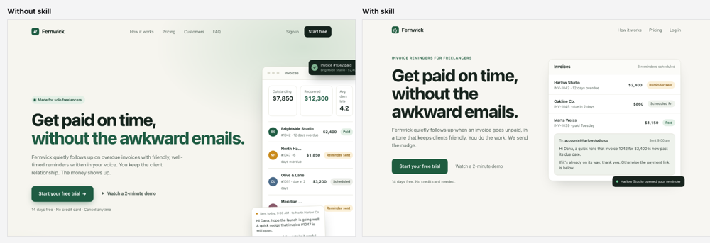
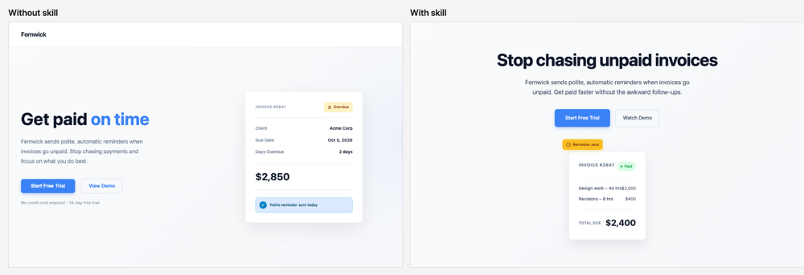
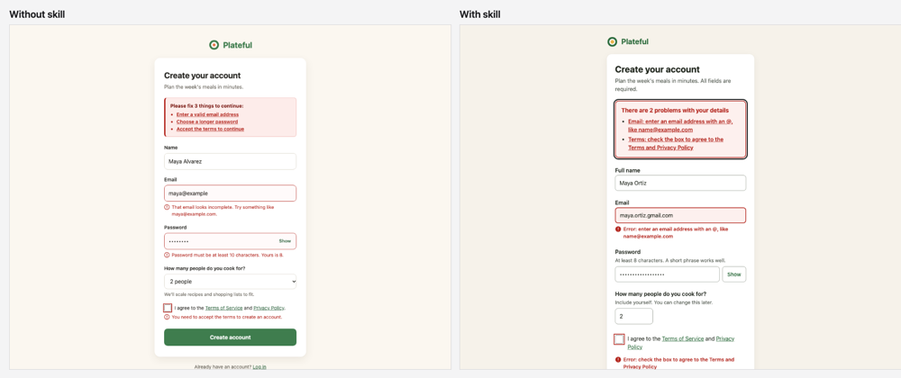
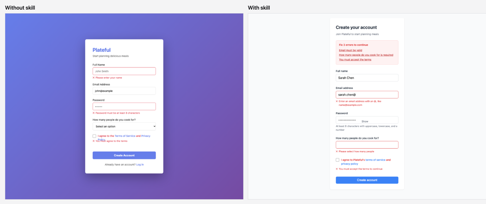
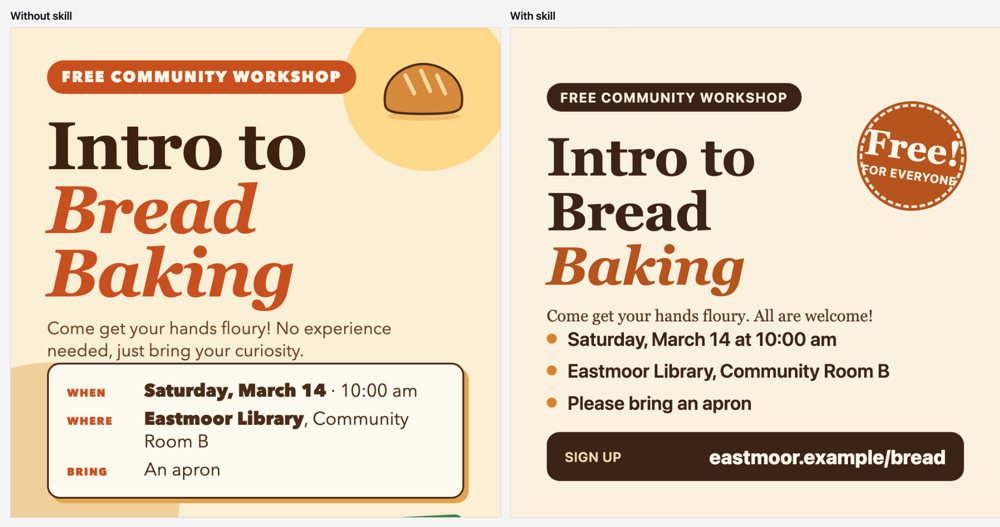
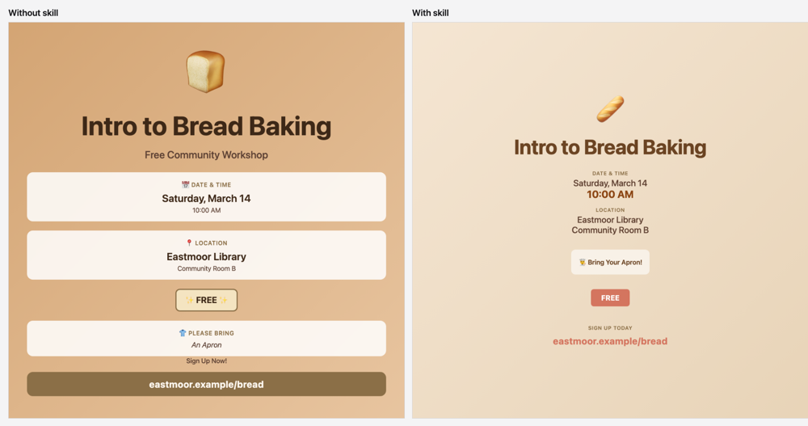

# Before and after: what a skill does to a design

Four realistic design requests, each given to the same model with and without one skill installed, rendered to PNG from the HTML the model wrote. Nothing was edited by hand. The main README links here.

## How to read this

- **Same prompt, one difference.** Both arms get the exact prompt shown below (plus one format line asking for a single self-contained HTML file). The only difference is that the skill folder is installed in the with-skill arm. The prompts do not mention any design rule.
- **Models and date.** `claude-sonnet-5-5` and `claude-haiku-4-5-20251001`, run on 2026-10-07 in installed mode (the skill is available to the model and the model decides whether to load it).
- **Three runs per arm, per model, per task** (24 generations per model). Each page is rendered at 1280x800, or 1280x1000 for the form and 1080x1080 for the card.
- **Judge.** `claude:opus`, which is a different model from both generators. It sees only the screenshots, anonymously, scores a rubric of five items from 1 to 5, and judges every pair twice with the sides swapped. Run *n* of one arm is shown opposite run *n* of the other.
- **The featured pair is the median, never the best.** The rule was written in `config.json` before the runs: rank each arm's three runs by rubric mean and show the median run of each arm. The contact sheet under each pair shows all six runs so the spread is visible.
- **Small by design.** Three runs and one judge per cell is an illustration, not a measurement. Run-to-run spread inside a single arm is 0.2 to 1.2 rubric points, so a gap below about half a point is inside the noise.

## The numbers

| Task (skill) | Model | Without: mean (range) | With: mean (range) | Difference | Skill invoked | Pair verdicts: with / without / tie |
| --- | --- | --- | --- | --- | --- | --- |
| Landing page hero (`visual-hierarchy`) | sonnet | 4.00 (3.8 to 4.4) | 4.83 (4.6 to 5.0) | +0.83 | 3 of 3 | 3 / 0 / 0 |
| Landing page hero (`visual-hierarchy`) | haiku | 4.30 (4.2 to 4.4) | 3.97 (3.8 to 4.2) | -0.33 | 2 of 3 | 0 / 3 / 0 |
| Revenue report: chart and table (`chart-design`) | sonnet | 4.40 (4.1 to 4.6) | 4.50 (4.3 to 4.7) | +0.10 | 3 of 3 | 1 / 0 / 2 |
| Revenue report: chart and table (`chart-design`) | haiku | 3.47 (3.2 to 3.7) | 3.13 (2.6 to 3.8) | -0.33 | 0 of 3 | 0 / 3 / 0 |
| Signup form with error states (`form-design`) | sonnet | 4.60 (4.4 to 4.8) | 4.80 (4.6 to 5.0) | +0.20 | 3 of 3 | 2 / 1 / 0 |
| Signup form with error states (`form-design`) | haiku | 3.67 (3.3 to 4.2) | 4.47 (3.9 to 4.8) | +0.80 | 3 of 3 | 3 / 0 / 0 |
| Workshop social card (`typesetting`) | sonnet | 3.73 (3.4 to 3.9) | 4.13 (3.8 to 4.5) | +0.40 | 0 of 3 | 1 / 1 / 1 |
| Workshop social card (`typesetting`) | haiku | 3.77 (3.6 to 3.9) | 3.80 (3.6 to 4.1) | +0.03 | 0 of 3 | 1 / 1 / 1 |
| **All four tasks** | **sonnet** | **4.18** | **4.57** | **+0.38** | **9 of 12** | **7 / 2 / 3** |
| **All four tasks** | **haiku** | **3.80** | **3.84** | **+0.04** | **5 of 12** | **4 / 7 / 1** |

Rubric means are on a 1 to 5 scale. Per-run scores, the judge's notes and the rubric for every task are in each folder's `meta.json`; `notes.md` in each task folder lists what changed in the featured pair and why.

## What the numbers show

**Sonnet.** Across all twelve pairs the with-skill pages averaged 4.57 against 4.18 without (+0.38), and the blind pairs split 7 for the skill, 2 against and 3 ties. Almost all of that comes from the landing hero (+0.83, three of three pairs); the form (+0.20) and the report (+0.10) are inside the run-to-run noise, and the without-skill pages were already competent on both (zero baselines, labeled fields, inline errors). The skill was invoked in 9 of 12 with-skill runs: every run for the hero, the report and the form, and none for the poster, so the poster's +0.40 compares two samples of the same condition and says nothing about the skill. What the skill visibly changed on the hero: one primary button instead of two, fewer decorative marks, fewer type styles and a product mock-up that fits the window. What it did not change: the headline size step, which was already large.

**Haiku.** The averages are level: 3.84 with against 3.80 without (+0.04), with 4 pairs for the skill, 7 against and 1 ties. That flat average hides a split. The form is a clear gain (+0.80, three of three pairs): visible password rules, 16px inputs and autofill attributes, a summary of errors with links. The landing hero lost (-0.33, three of three pairs to the without side), partly through craft errors in the with-skill card that the skill does not address. The skill was invoked in only 5 of 12 runs (never for the report or the poster), so those two rows compare two samples of the same condition. One with-skill report run drew no bars at all and scored 2.6, which is in the spread. Treat haiku's effect on these four prompts as unproven: small, task-dependent and sometimes negative.

**Also worth knowing.** Whether the skill loaded at all was a major source of variation in this set. The `typesetting` skill never loaded on the poster for either model, and `chart-design` never loaded for haiku's report. A skill that is not loaded cannot help, and these runs show that loading is not guaranteed in installed mode.

## Landing page hero

Skill installed: `visual-hierarchy`.

**Prompt:**

> Make the hero section of a landing page for Fernwick, a small tool that sends polite automatic reminders when a freelancer's invoices go unpaid. I want a headline, a short paragraph under it, a main button to start a free trial, a quieter link for a demo, and some kind of product visual built with HTML and CSS. It should feel like a real startup site.

**Sonnet** (median pair: without run 3, with run 2; rubric means 3.8 without and 4.9 with; all runs 3.8, 4.4, 3.8 without and 4.6, 4.9, 5.0 with; skill invoked in 3 of 3 with-skill runs)



[All six runs](landing-hero/sonnet/contact-sheet.png) · [Run data](landing-hero/sonnet/meta.json)

**Haiku** (median pair: without run 2, with run 2; rubric means 4.3 without and 3.9 with; all runs 4.2, 4.3, 4.4 without and 3.8, 3.9, 4.2 with; skill invoked in 2 of 3 with-skill runs)



[All six runs](landing-hero/haiku/contact-sheet.png) · [Run data](landing-hero/haiku/meta.json)

What changed and why, in detail: [landing-hero/notes.md](landing-hero/notes.md).

## Revenue report: chart and table

Skill installed: `chart-design`.

**Prompt:**

> Make a one-page monthly report for a small coffee roastery called Ember & Oak that I can screenshot and send to my business partner. It needs a chart of weekly revenue for the last 12 weeks and a table of the top 6 products with units sold and revenue. Make up realistic numbers. It should all fit on one laptop screen.

**Sonnet** (median pair: without run 3, with run 2; rubric means 4.5 without and 4.5 with; all runs 4.6, 4.1, 4.5 without and 4.7, 4.5, 4.3 with; skill invoked in 3 of 3 with-skill runs)


[All six runs](revenue-report/sonnet/contact-sheet.png) · [Run data](revenue-report/sonnet/meta.json)

**Haiku** (median pair: without run 1, with run 2; rubric means 3.5 without and 3.0 with; all runs 3.5, 3.7, 3.2 without and 3.8, 3.0, 2.6 with; skill invoked in 0 of 3 with-skill runs)


[All six runs](revenue-report/haiku/contact-sheet.png) · [Run data](revenue-report/haiku/meta.json)

What changed and why, in detail: [revenue-report/notes.md](revenue-report/notes.md).

## Signup form with error states

Skill installed: `form-design`.

**Prompt:**

> Build the signup page for a meal-planning app called Plateful: name, email, password, how many people they cook for, and a terms checkbox. Show the page as it looks right after someone pressed the button with a couple of mistakes, so I can see how the errors look.

**Sonnet** (median pair: without run 3, with run 3; rubric means 4.6 without and 4.8 with; all runs 4.4, 4.8, 4.6 without and 5.0, 4.6, 4.8 with; skill invoked in 3 of 3 with-skill runs)



[All six runs](signup-errors/sonnet/contact-sheet.png) · [Run data](signup-errors/sonnet/meta.json)

**Haiku** (median pair: without run 1, with run 2; rubric means 3.5 without and 4.7 with; all runs 3.5, 4.2, 3.3 without and 3.9, 4.7, 4.8 with; skill invoked in 3 of 3 with-skill runs)



[All six runs](signup-errors/haiku/contact-sheet.png) · [Run data](signup-errors/haiku/meta.json)

What changed and why, in detail: [signup-errors/notes.md](signup-errors/notes.md).

## Workshop social card

Skill installed: `typesetting`.

**Prompt:**

> Make a square 1080x1080 social media card announcing a free community workshop, Intro to Bread Baking, on Saturday, March 14 at 10:00 am at the Eastmoor Library, community room B. It is free, people should bring an apron, and they can sign up at eastmoor.example/bread. Keep it friendly.

**Sonnet** (median pair: without run 2, with run 3; rubric means 3.9 without and 4.1 with; all runs 3.4, 3.9, 3.9 without and 4.5, 3.8, 4.1 with; skill invoked in 0 of 3 with-skill runs)



[All six runs](workshop-poster/sonnet/contact-sheet.png) · [Run data](workshop-poster/sonnet/meta.json)

**Haiku** (median pair: without run 1, with run 1; rubric means 3.8 without and 3.7 with; all runs 3.8, 3.9, 3.6 without and 3.7, 3.6, 4.1 with; skill invoked in 0 of 3 with-skill runs)



[All six runs](workshop-poster/haiku/contact-sheet.png) · [Run data](workshop-poster/haiku/meta.json)

What changed and why, in detail: [workshop-poster/notes.md](workshop-poster/notes.md).

## Reproduce

```
python3 scripts/make_example.py docs/examples/config.json --model sonnet
python3 scripts/make_example.py docs/examples/config.json --model haiku
```

Finished runs are kept in each `runs/` folder and reused on a rerun, so a run that stops partway resumes; delete a run's files to regenerate it. The judge must differ from the generator (`--judge` overrides the config).
