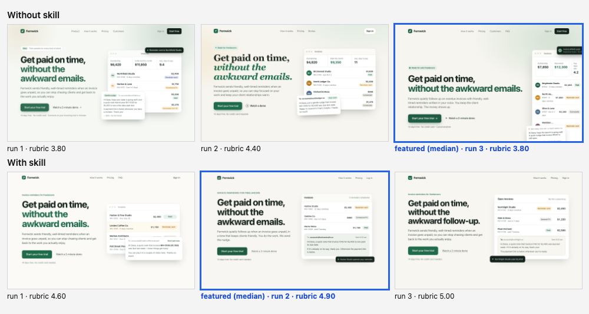
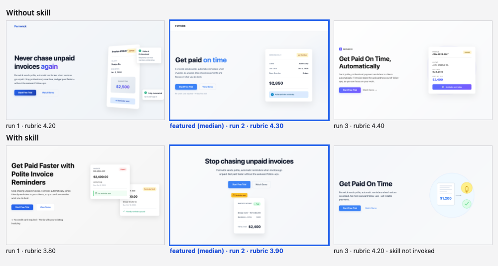

# Landing page hero

Skill installed in the with-skill arm: `visual-hierarchy`. Run on 2026-10-07; 3 runs per arm per model; judged blind by `claude:opus` (two passes per pair with the sides swapped, scores averaged).

**Prompt (identical in both arms, exactly as typed):**

> Make the hero section of a landing page for Fernwick, a small tool that sends polite automatic reminders when a freelancer's invoices go unpaid. I want a headline, a short paragraph under it, a main button to start a free trial, a quieter link for a demo, and some kind of product visual built with HTML and CSS. It should feel like a real startup site.

The harness appends one format instruction in both arms: *Return the result as a single self-contained HTML file: all CSS inline, no external requests, system fonts only. Reply with one ```html fenced block and nothing else.*

**Rubric the judge scored (1 to 5 per item):**

1. One element is clearly read first: the headline is much larger than the body text and nothing else competes with it.
2. There is exactly one primary call to action; the secondary link is visibly quieter than the button.
3. The paragraph under the headline has a comfortable line length (about 40 to 75 characters) and secondary text still has strong contrast against its background.
4. Spacing groups the headline, paragraph and buttons as one unit, with generous whitespace and consistent alignment of edges.
5. The product visual looks specific to an invoice-reminder tool and supports the message without competing with the headline.

**Featuring rule (from `config.json`):** Declared before any run: rank the 3 without-skill runs and the 3 with-skill runs separately by the blind judge's rubric mean (two passes with the sides swapped, scores averaged), and feature the median run of each arm. The best run is never chosen. The contact sheet shows all six runs.

## Sonnet (`claude-sonnet-5-5`)




| Run | Without skill: rubric mean | With skill: rubric mean | With skill: skill invoked | Pair verdict (blind, swap-checked) |
| --- | --- | --- | --- | --- |
| 1 | 3.8 | 4.6 | yes | with |
| 2 | 4.4 | 4.9 **(featured)** | yes | with |
| 3 | 3.8 **(featured)** | 5.0 | yes | with |
| mean | 4.00 | 4.83 | 3 of 3 | |

Rubric means are the judge's 1 to 5 scores averaged over the rubric items and both passes. Run *n* of one arm was shown to the judge opposite run *n* of the other, so a mean also reflects its partner.

**Featured pair:** without-skill run 3 against with-skill run 2 (the median run of each arm). The skill was invoked in all three with-skill runs.

**What changed, and why**

- **Headline step: no difference.** Both pages set the headline at 64px with line-height 1.04 over 19px body text (a 3.4x step). The rule "neighboring levels differ visibly" was already met without the skill, so nothing changed here.
- **One primary action instead of two.** The without page has two solid dark-green buttons in the first screen (the nav's "Start free" and the hero's "Start your free trial"); the with page has one, and its nav is plain text links. Rule: one primary action style per decision group (visual-hierarchy procedure step 5).
- **Fewer marks with no job.** The without page has a gradient wash behind the hero, a pill badge, a floating "Invoice #1042 paid" toast and an email bubble (2 gradient declarations, 5 box-shadow rules). The with page has no gradients, 2 shadow rules and one floating status chip. Rule: every line, shadow, gradient or badge must organize, emphasize or identify (step 9).
- **The product visual stays in its place.** The without page is 1010px tall in an 800px window: the mock-up's last invoice row and email bubble are cut off at the bottom and the toast is clipped at the right edge. The with page is 705px tall and the whole mock-up is visible. Rule: an illustration or mock-up louder than the headline is a failure mode; reduce its size and value contrast.
- **Fewer type styles.** Counting every text element including the mock-up, the without page uses 11 distinct font sizes and 6 weights; the with page uses 8 sizes and 5 weights. Rule: repeat roles exactly, one treatment per role (step 8).
- **Not a difference: contrast and line length.** The paragraph runs 53 characters per line without and 44 with, both inside a comfortable range. Text contrast was fine on both (one 12px avatar initial at 2.94:1 on the without page, nothing under 4.5:1 on the with page).

**How big is it here?** Largest gap in the set: with-skill rubric mean 4.83 against 4.00 without, and all three blind pairs went to the with side. Run-to-run spread inside the without arm was 0.6 (3.8 to 4.4), so a gap of 0.8 is bigger than the noise, but it is one prompt and three runs.

## Haiku (`claude-haiku-4-5-20251001`)




| Run | Without skill: rubric mean | With skill: rubric mean | With skill: skill invoked | Pair verdict (blind, swap-checked) |
| --- | --- | --- | --- | --- |
| 1 | 4.2 | 3.8 | yes | without |
| 2 | 4.3 **(featured)** | 3.9 **(featured)** | yes | without |
| 3 | 4.4 | 4.2 | no | without |
| mean | 4.30 | 3.97 | 2 of 3 | |

Rubric means are the judge's 1 to 5 scores averaged over the rubric items and both passes. Run *n* of one arm was shown to the judge opposite run *n* of the other, so a mean also reflects its partner.

**Featured pair:** without-skill run 2 against with-skill run 2. The skill was invoked in two of the three with-skill runs, including the featured one.

**What changed, and why**

- **The without side won this task.** All three blind pairs went to the without page, and its mean was higher (4.30 against 3.97).
- **Headline: same size, different composition.** Both set the headline at 56px. The without page left-aligns it over two lines beside a product card; the with page centers it on one line over a centered 20px paragraph (58 characters per line against 40 at 18px with a 1.8 line height) and drops the product card below the buttons. Rule: a centered composition is allowed for a short single-focus hero (visual-hierarchy, centering judgment call), so this is the skill working as written; the result shows less of the product and left more empty space.
- **Craft flaws the skill does not address.** On the with page the card's "Design work - 40 hrs" text touches "$2,000", the card says both "Paid" and "Total due", and a "Reminder sent" badge hangs off its edge. The without page's card (Overdue, $2,850, "Polite reminder sent today") is specific to the product and tidy. These are generation errors, not hierarchy choices.
- **Contrast: both fall short, neither is better.** Lowest text contrast was 2.47:1 on the without page (the 13px "No credit card required" line) and 3.0:1 on the with page (a 12px status pill); the with page's white-on-blue button label measures 3.68:1. Both pages break the rule against hierarchy by fading text.
- **Emphasis.** The without page colors "on time" in the accent blue (3.55:1 at 56px); the with page uses a single color for the headline and puts all of its emphasis on the one filled button.

**How big is it here?** Negative here: -0.33 on the mean (3.97 with, 4.30 without). Spread inside the without arm was 0.2 and inside the with arm 0.4, so this is a small but consistent loss on this prompt, and I would not read it as a general result for the skill on haiku.

## Method

Numbers in the notes were measured in headless Chrome at the render size by reading computed styles of the featured pages (font sizes, line counts, text contrast against the nearest solid background; gradient and image backgrounds are not measured). Every featured page is in `<model>/with.html` and `<model>/without.html`, and every run is in `<model>/runs/`. Nothing was edited by hand.
