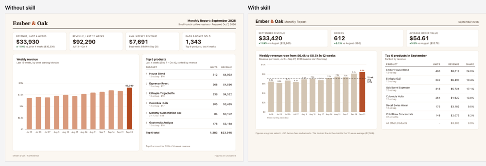
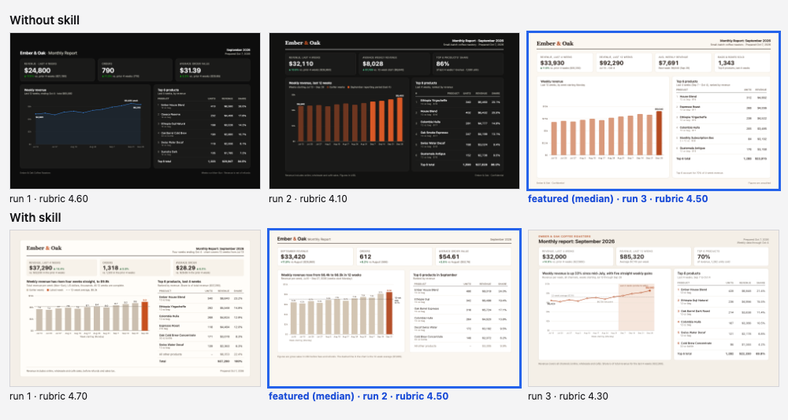
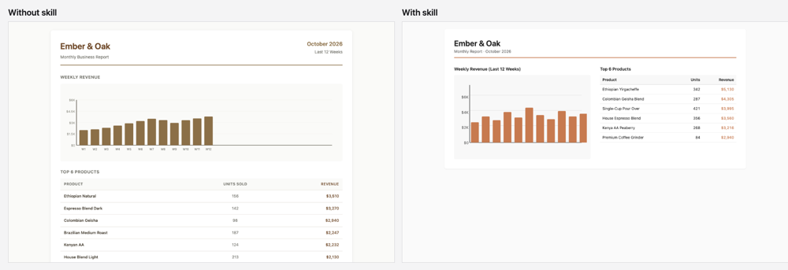
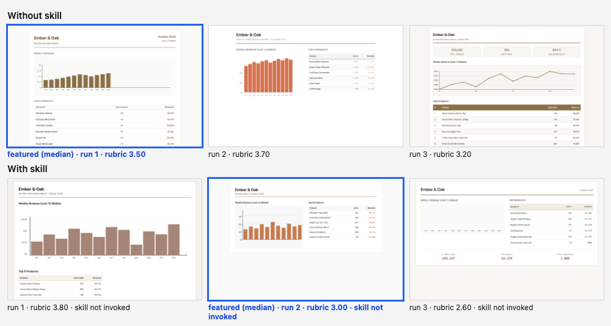

# Revenue report with a chart and a table

Skill installed in the with-skill arm: `chart-design`. Run on 2026-10-07; 3 runs per arm per model; judged blind by `claude:opus` (two passes per pair with the sides swapped, scores averaged).

**Prompt (identical in both arms, exactly as typed):**

> Make a one-page monthly report for a small coffee roastery called Ember & Oak that I can screenshot and send to my business partner. It needs a chart of weekly revenue for the last 12 weeks and a table of the top 6 products with units sold and revenue. Make up realistic numbers. It should all fit on one laptop screen.

The harness appends one format instruction in both arms: *Return the result as a single self-contained HTML file: all CSS inline, no external requests, system fonts only. Reply with one ```html fenced block and nothing else.*

**Rubric the judge scored (1 to 5 per item):**

1. The chart is an honest, readable form for a 12-week trend: a baseline that starts at zero or is clearly marked, labelled units, and no distorted scale.
2. The chart is labelled directly or with a minimal axis: few gridlines, no heavy borders, no legend for a single series, and the title says what is shown.
3. Table numbers are right-aligned with consistent decimals and currency formatting, and the columns are easy to scan.
4. Colour is restrained: one main colour for the data, with any highlight used on purpose rather than for decoration.
5. Chart and table form one coherent page with clear hierarchy, and nothing is clipped or overflowing.

**Featuring rule (from `config.json`):** Declared before any run: rank the 3 without-skill runs and the 3 with-skill runs separately by the blind judge's rubric mean (two passes with the sides swapped, scores averaged), and feature the median run of each arm. The best run is never chosen. The contact sheet shows all six runs.

## Sonnet (`claude-sonnet-5-5`)





| Run | Without skill: rubric mean | With skill: rubric mean | With skill: skill invoked | Pair verdict (blind, swap-checked) |
| --- | --- | --- | --- | --- |
| 1 | 4.6 | 4.7 | yes | with |
| 2 | 4.1 | 4.5 **(featured)** | yes | tie (judge passes disagreed) |
| 3 | 4.5 **(featured)** | 4.3 | yes | tie (judge passes disagreed) |
| mean | 4.40 | 4.50 | 3 of 3 | |

Rubric means are the judge's 1 to 5 scores averaged over the rubric items and both passes. Run *n* of one arm was shown to the judge opposite run *n* of the other, so a mean also reflects its partner.

**Featured pair:** without-skill run 3 against with-skill run 2. The skill was invoked in all three with-skill runs.

**What changed, and why**

- **The title states the finding.** The without chart is titled "Weekly revenue" with a descriptive subtitle; the with chart is titled "Weekly revenue rose from $6.4k to $8.5k in 12 weeks". Rule: for an explanatory chart the finding becomes the title (chart-design procedure step 1).
- **A comparison on the chart.** The with chart draws a dashed 12-week average line labeled "12-wk avg $7.1k"; the without chart marks only the latest bar with its value ($9,040). Both give the KPI tiles a comparison (prior 4 weeks, or August). Rule: put the benchmark on the chart, because a number alone has no meaning (step 6).
- **Direct labels.** The with chart prints a value above every bar and an end label for the average; the without chart relies on axis ticks at $2.5k steps plus the one labeled bar. Rule: label directly (step 7). The cost: the bar labels are 10px, the smallest text on the page, and the with page has 56 text elements at 13px or smaller against 48.
- **Table completeness.** The with table adds a Share column and an "All other products" row so it accounts for the whole month; the without table adds a product sub-line and a "Top 6 total" row. Both right-align figures and use tabular numerals.
- **Not a difference: baseline, color, gridlines.** Both bar charts start at $0, use a muted bar color with one darker accent on the latest week, and keep gridlines faint. The without page already did the honest-scale basics, which is why the gap is small.

**How big is it here?** Within noise: with-skill mean 4.50 against 4.40 without (+0.10). Pair verdicts were one with-skill win and two ties, and two of the three pairs had judge passes that disagreed. Spread inside either arm was 0.4 to 0.5, larger than the gap.

## Haiku (`claude-haiku-4-5-20251001`)





| Run | Without skill: rubric mean | With skill: rubric mean | With skill: skill invoked | Pair verdict (blind, swap-checked) |
| --- | --- | --- | --- | --- |
| 1 | 3.5 **(featured)** | 3.8 | no | without |
| 2 | 3.7 | 3.0 **(featured)** | no | without |
| 3 | 3.2 | 2.6 | no | without |
| mean | 3.47 | 3.13 | 0 of 3 | |

Rubric means are the judge's 1 to 5 scores averaged over the rubric items and both passes. Run *n* of one arm was shown to the judge opposite run *n* of the other, so a mean also reflects its partner.

**Featured pair:** without-skill run 1 against with-skill run 2. **The skill was not invoked in any of the three with-skill runs**, so the two arms are two samples of the same condition and the differences below are run-to-run variation, not a skill effect.

**What changed, and why**

- **Chart labels.** The without chart labels all twelve weeks (W1 to W12); the with chart has no week labels and sits in a grey backing box.
- **Table alignment.** The with table right-aligns both numeric columns; the without table centers the Units column. 
- **Fit.** The without page is 920px tall in an 800px window and its table reaches the bottom edge of the window; the with page fits with space to spare but puts the chart and table side by side and leaves the lower third empty.
- **Run 3 of the with arm drew no bars at all** (only week labels rendered), which is why that run scored 2.6. It is counted in the spread and was not featured because the featuring rule takes the median.
- **Contrast.** Lowest text contrast was 2.84:1 on the without page (an 11px summary line) and 3.32:1 on the with page (orange table figures).

**How big is it here?** No skill effect to measure: the skill never loaded. With-skill mean 3.13 against 3.47 without; the spread inside the with arm (2.6 to 3.8) is wider than the gap.

## Method

Numbers in the notes were measured in headless Chrome at the render size by reading computed styles of the featured pages (font sizes, line counts, text contrast against the nearest solid background; gradient and image backgrounds are not measured). Every featured page is in `<model>/with.html` and `<model>/without.html`, and every run is in `<model>/runs/`. Nothing was edited by hand.
