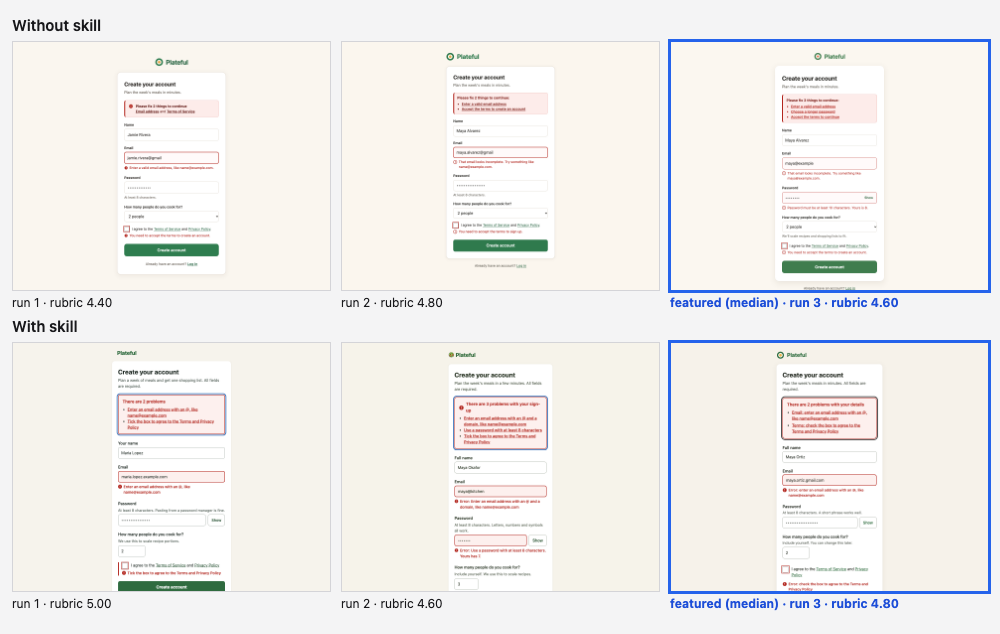
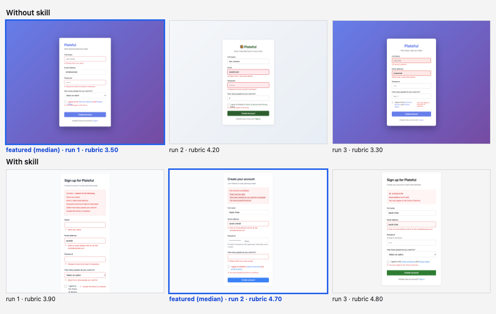

# Signup form with error states

Skill installed in the with-skill arm: `form-design`. Run on 2026-10-07; 3 runs per arm per model; judged blind by `claude:opus` (two passes per pair with the sides swapped, scores averaged).

**Prompt (identical in both arms, exactly as typed):**

> Build the signup page for a meal-planning app called Plateful: name, email, password, how many people they cook for, and a terms checkbox. Show the page as it looks right after someone pressed the button with a couple of mistakes, so I can see how the errors look.

The harness appends one format instruction in both arms: *Return the result as a single self-contained HTML file: all CSS inline, no external requests, system fonts only. Reply with one ```html fenced block and nothing else.*

**Rubric the judge scored (1 to 5 per item):**

1. Every field has a visible label that stays on screen, not a placeholder standing in for a label.
2. Each error message sits next to the field it belongs to, says in plain words what to fix, and does not rely on colour alone.
3. What the person already typed is kept, and the password requirements are visible without having to fail first.
4. The form is a single clear column with one primary button and a sensible order and grouping of fields.
5. Inputs are easy to see and use: visible borders, comfortable height and legible text size.

**Featuring rule (from `config.json`):** Declared before any run: rank the 3 without-skill runs and the 3 with-skill runs separately by the blind judge's rubric mean (two passes with the sides swapped, scores averaged), and feature the median run of each arm. The best run is never chosen. The contact sheet shows all six runs.

## Sonnet (`claude-sonnet-5-5`)




| Run | Without skill: rubric mean | With skill: rubric mean | With skill: skill invoked | Pair verdict (blind, swap-checked) |
| --- | --- | --- | --- | --- |
| 1 | 4.4 | 5.0 | yes | with |
| 2 | 4.8 | 4.6 | yes | without |
| 3 | 4.6 **(featured)** | 4.8 **(featured)** | yes | with |
| mean | 4.60 | 4.80 | 3 of 3 | |

Rubric means are the judge's 1 to 5 scores averaged over the rubric items and both passes. Run *n* of one arm was shown to the judge opposite run *n* of the other, so a mean also reflects its partner.

**Featured pair:** without-skill run 3 against with-skill run 3 (the median of each arm). The skill was invoked in all three with-skill runs.

**What changed, and why**

- **The password rule is visible before typing.** The with form prints "At least 8 characters. A short phrase works well." under the Password label; the without form shows its rule only after failing ("Password must be at least 10 characters. Yours is 8."). Rule: show constraints between the label and the field, before the person types (form-design, passwords).
- **Required fields are stated.** The with intro says "All fields are required."; the without form says nothing. Rule: mark required or optional once the questions are cut.
- **Error wording.** Both put a message with an icon next to each failing field, and both keep the typed values. The without messages are slightly more specific ("That email looks incomplete. Try something like maya@example.com", "Yours is 8"). The with messages are "Error: enter an email address with an @, like name@example.com" and "Error: check the box to agree to the Terms and Privacy Policy", prefixed with a text cue. Neither side clearly wins on wording.
- **Summary box.** The without summary is a quiet pink box listing three short links at 14px. The with summary repeats each full message at 16px bold, underlined, inside a thick dark-red outline, so the message appears twice and the box is the loudest thing on the page. Rule: with two or more problems, a summary links to each field (form-design, errors); the skill does not call for repeating the full text.
- **Input and label size.** With: labels and inputs 16px, fields at least 46px tall, three autocomplete tokens. Without: input text 16px, labels 14px, error text 13.5px, three autocomplete tokens. Rule: input text at 16px or more so phones do not zoom, touch targets about 44px.
- **The with page loses on fit.** It is 1212px tall against 1057px, so in a 1280x1000 window the "Create account" button (top at 1032px) falls below the bottom edge, while the without page's button (882px) is visible. Taller helper text and larger sizes cost the with page its primary action above the fold in this screenshot.

**How big is it here?** Small positive: with-skill mean 4.80 against 4.60 without (+0.20); pair verdicts were two with-skill wins and one without-skill win. Spread inside the without arm was 0.4, so the gap is inside the noise. The without form was already a competent form.

## Haiku (`claude-haiku-4-5-20251001`)




| Run | Without skill: rubric mean | With skill: rubric mean | With skill: skill invoked | Pair verdict (blind, swap-checked) |
| --- | --- | --- | --- | --- |
| 1 | 3.5 **(featured)** | 3.9 | yes | with |
| 2 | 4.2 | 4.7 **(featured)** | yes | with |
| 3 | 3.3 | 4.8 | yes | with |
| mean | 3.67 | 4.47 | 3 of 3 | |

Rubric means are the judge's 1 to 5 scores averaged over the rubric items and both passes. Run *n* of one arm was shown to the judge opposite run *n* of the other, so a mean also reflects its partner.

**Featured pair:** without-skill run 1 against with-skill run 2. The skill was invoked in all three with-skill runs.

**What changed, and why**

- **Not a difference: labels.** Both forms put a visible label above every field and keep the typed values; the without form uses "John Smith" as a placeholder example in the empty name field, which is an acceptable use of a placeholder.
- **Password requirements before failure.** The with form prints "At least 8 characters with uppercase, lowercase, and a number" under the field; the without form shows a rule only in the error. Rule: show password rules before typing.
- **Errors.** Both use an icon and text under each failing field. The with form adds a summary box of three jump links at the top and keeps the typed value in the email field ("sarah.chen@"). In the without render, the wrapped "Policy" line of the terms label collides with the error text beneath it.
- **Size and autofill.** Input text is 16px with autocomplete tokens for name, email and new password on the with form, against 14px and no autocomplete attributes on the without form. Rule: 16px minimum so phones do not zoom; standard autofill tokens for name, email and new password.
- **Not a difference: contrast.** Lowest text contrast was 3.66:1 without (blue links, wordmark) and 3.68:1 with (blue links and the white-on-blue button), so neither clears 4.5:1 for small text; the without page also sits on a purple gradient.

**How big is it here?** Clear positive: with-skill mean 4.47 against 3.67 without (+0.80), all three blind pairs went to the with side, and the with arm's worst run (3.9) beat the without arm's mean. This is the biggest and most consistent effect for haiku.

## Method

Numbers in the notes were measured in headless Chrome at the render size by reading computed styles of the featured pages (font sizes, line counts, text contrast against the nearest solid background; gradient and image backgrounds are not measured). Every featured page is in `<model>/with.html` and `<model>/without.html`, and every run is in `<model>/runs/`. Nothing was edited by hand.
