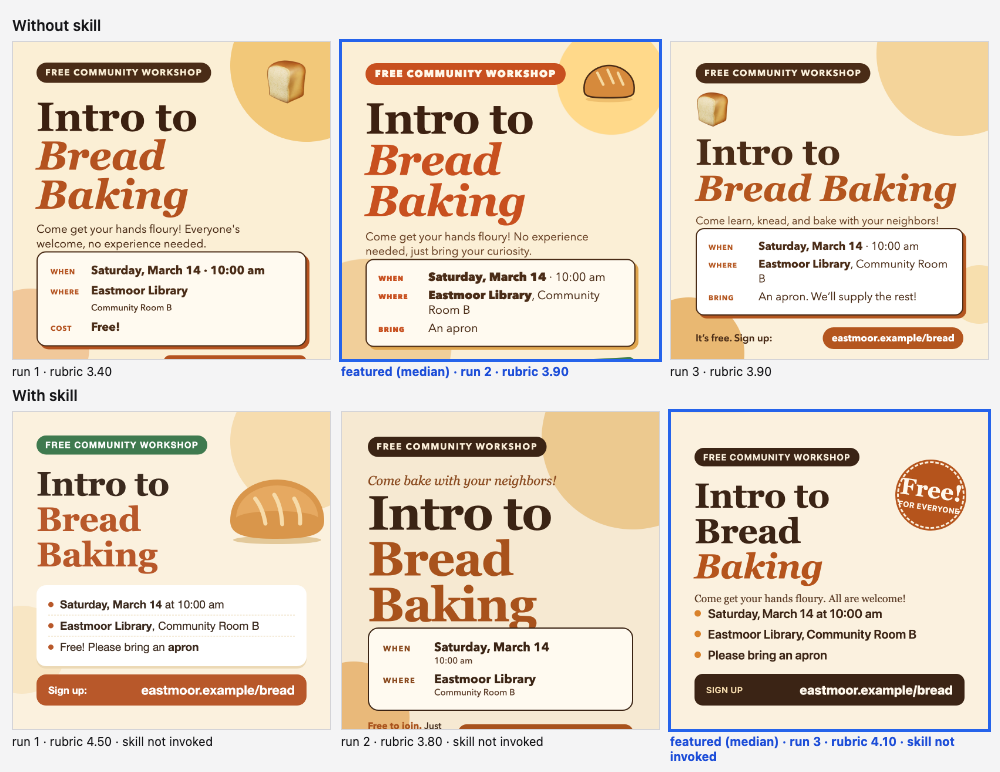
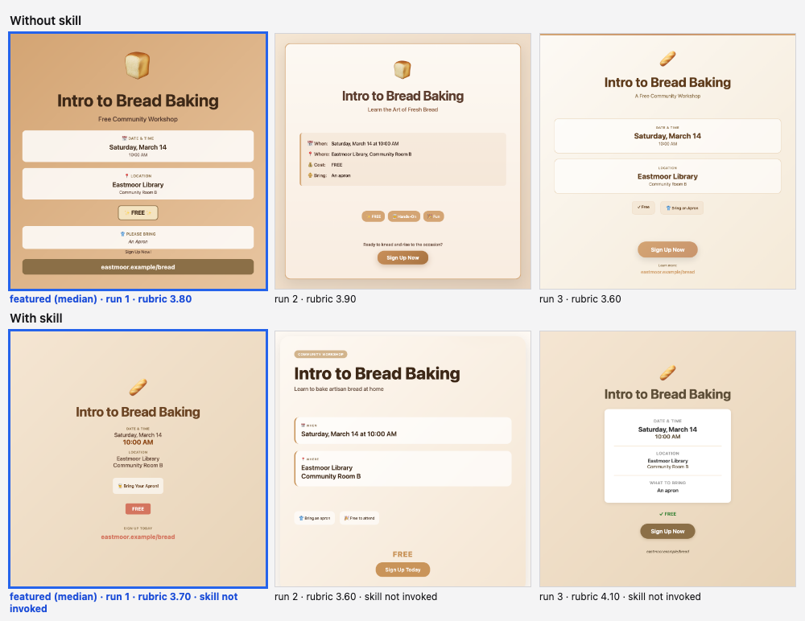

# Workshop social card

Skill installed in the with-skill arm: `typesetting`. Run on 2026-10-07; 3 runs per arm per model; judged blind by `claude:opus` (two passes per pair with the sides swapped, scores averaged).

**Prompt (identical in both arms, exactly as typed):**

> Make a square 1080x1080 social media card announcing a free community workshop, Intro to Bread Baking, on Saturday, March 14 at 10:00 am at the Eastmoor Library, community room B. It is free, people should bring an apron, and they can sign up at eastmoor.example/bread. Keep it friendly.

The harness appends one format instruction in both arms: *Return the result as a single self-contained HTML file: all CSS inline, no external requests, system fonts only. Reply with one ```html fenced block and nothing else.*

**Rubric the judge scored (1 to 5 per item):**

1. The workshop title is clearly the dominant element and is much larger than every other piece of text.
2. The date, time and place are easy to find, grouped together, and use no more than about three levels of emphasis overall.
3. Lines are set comfortably: sensible line length and line-height, no awkward one-word last lines, and no clipped or cramped text.
4. The card uses a small, consistent set of type styles (one or two families, few sizes and weights) with consistent alignment.
5. All text, including the smallest line, has strong contrast and is readable at phone size.

**Featuring rule (from `config.json`):** Declared before any run: rank the 3 without-skill runs and the 3 with-skill runs separately by the blind judge's rubric mean (two passes with the sides swapped, scores averaged), and feature the median run of each arm. The best run is never chosen. The contact sheet shows all six runs.

## Sonnet (`claude-sonnet-5-5`)




| Run | Without skill: rubric mean | With skill: rubric mean | With skill: skill invoked | Pair verdict (blind, swap-checked) |
| --- | --- | --- | --- | --- |
| 1 | 3.4 | 4.5 | no | with |
| 2 | 3.9 **(featured)** | 3.8 | no | without |
| 3 | 3.9 | 4.1 **(featured)** | no | tie (judge passes disagreed) |
| mean | 3.73 | 4.13 | 0 of 3 | |

Rubric means are the judge's 1 to 5 scores averaged over the rubric items and both passes. Run *n* of one arm was shown to the judge opposite run *n* of the other, so a mean also reflects its partner.

**Featured pair:** without-skill run 2 against with-skill run 3. **The skill (`typesetting`) was not invoked in any of the three with-skill runs**, so the arms are two samples of the same condition and these differences are run-to-run variation, not a skill effect.

**What changed, and why**

- **The sign-up line is cut off in the featured without poster.** Its "Sign up at eastmoor.example/bread" line starts at 1075px in a 1080px card, five pixels inside the bottom edge, so the URL is effectively out of frame; the with poster shows the URL in a dark bar at the bottom, fully inside the frame.
- **Title size.** The title is 148px on the without poster and 118px on the with poster; the next-largest text is 40px and 44px (not counting the 78px stamp), so the title dominates on both.
- **Grouping of the details.** The without poster puts WHEN, WHERE and BRING in a boxed card with 24px small-caps labels and 40px values, and "Community Room B" wraps leaving "Room B" alone on a second line. The with poster sets three bullet lines at 42px/600, none wrapping.
- **A stray element.** The with poster adds a "Free!" stamp whose "for everyone" line touches the circle's edge.
- **Type inventory.** 6 distinct sizes on the without poster and 7 on the with poster; two families on both.

**How big is it here?** No skill effect to measure: the skill never loaded. With-skill mean 4.13 against 3.73 without, with verdicts of one with win, one without win and one tie; the arms' internal spreads (3.4 to 3.9 and 3.8 to 4.5) are as wide as the gap. The one hard difference (a clipped sign-up URL) is a layout accident of one without run.

## Haiku (`claude-haiku-4-5-20251001`)




| Run | Without skill: rubric mean | With skill: rubric mean | With skill: skill invoked | Pair verdict (blind, swap-checked) |
| --- | --- | --- | --- | --- |
| 1 | 3.8 **(featured)** | 3.7 **(featured)** | no | tie (judge passes disagreed) |
| 2 | 3.9 | 3.6 | no | without |
| 3 | 3.6 | 4.1 | no | with |
| mean | 3.77 | 3.80 | 0 of 3 | |

Rubric means are the judge's 1 to 5 scores averaged over the rubric items and both passes. Run *n* of one arm was shown to the judge opposite run *n* of the other, so a mean also reflects its partner.

**Featured pair:** without-skill run 1 against with-skill run 1. **The skill was not invoked in any of the three with-skill runs**, so the arms are two samples of the same condition.

**What changed, and why**

- **Same design, two samples.** Both are a centered column on a warm gradient with an emoji at the top, the title, then the details. The without version puts each detail in its own rounded card (four stacked cards); the with version sets the details as plain centered text with a small FREE pill.
- **Title size.** 72px without, 56px with.
- **Sign-up line.** A full-width brown bar with white 26px text (4.47:1) on the without poster; coral 26px text with 3.23:1 contrast on the with poster.

**How big is it here?** No difference worth reporting: the featured pair scored 3.8 without and 3.7 with, the all-run means are 3.77 without and 3.80 with, and the three pair verdicts were a tie, a without win and a with win.

## Method

Numbers in the notes were measured in headless Chrome at the render size by reading computed styles of the featured pages (font sizes, line counts, text contrast against the nearest solid background; gradient and image backgrounds are not measured). Every featured page is in `<model>/with.html` and `<model>/without.html`, and every run is in `<model>/runs/`. Nothing was edited by hand.
